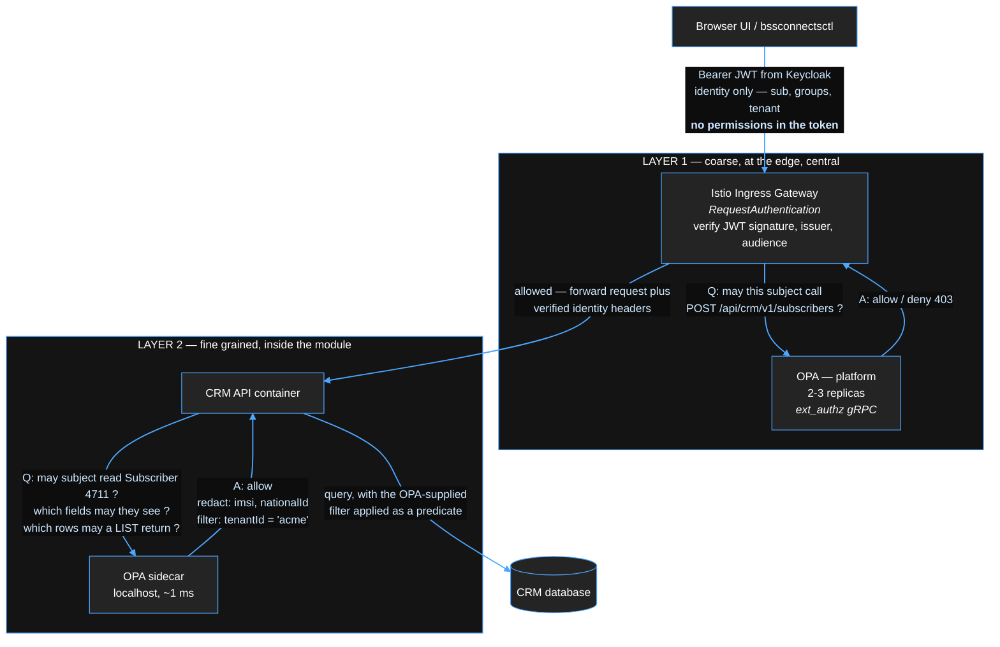
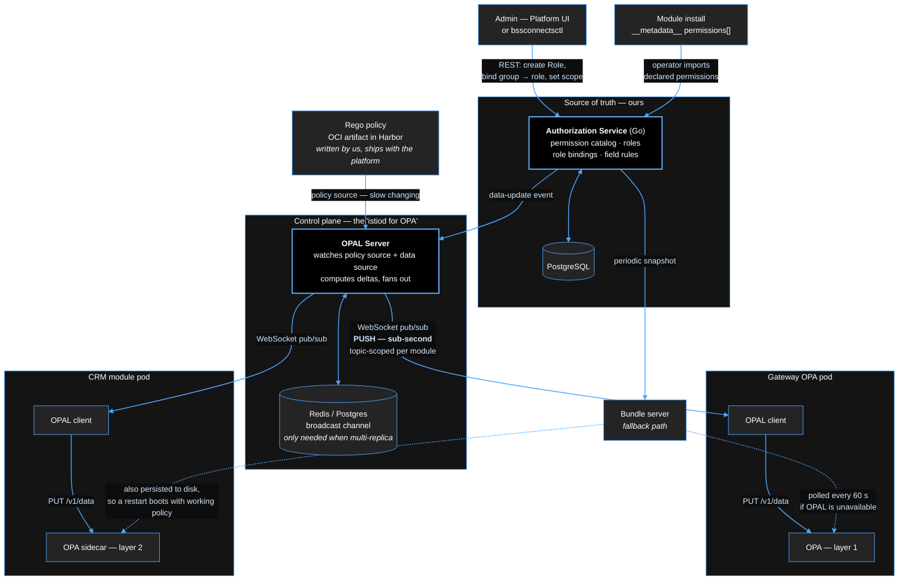

# 02 — Platform Core Components

**Status:** in progress
**Scope:** the components installed when we deploy the *empty* platform at a customer,
before any module license exists.

The rule that governs every choice here: **Platform Core must not know the name of any
product.** If a component needs to be told "this is Mediation", it belongs in a module,
not in core.

---

## 0. Summary of decisions

| Concern | Decision | Alternatives rejected |
|---|---|---|
| Identity (authn) | **Keycloak** | Ory Hydra/Kratos, Authentik, custom |
| Authorization (authz) | **Central Authorization Service + OPA** (sidecar/library) | Cedar, OpenFGA, Casbin, roles-in-JWT only |
| Image & chart registry | **Harbor** (already in use), OCI charts + per-customer robot accounts | ChartMuseum, Nexus |
| Deployment engine | **Flux** (HelmRelease / OCIRepository) | Argo CD, Helm SDK inside our operator |
| Platform logic | **Custom operator, kubebuilder** — owns CRDs, emits Flux objects | Helm-SDK operator, shell/Ansible operator |
| Ingress / service mesh | **Istio + Gateway API**, `ext_authz` to OPA | Envoy Gateway, Kong, NGINX Ingress |
| Licensing | **`License` CRD + dedicated License Service**, Ed25519-signed JWS | PASETO, license inside operator only, online-only licensing |
| UI shell | **React shell + Module Federation + metadata-driven renderer** | Backstage, iframe-per-module, one SPA per product |
| Database | **CloudNativePG** (Postgres operator) | Bitnami chart, external DB only |
| Event backbone | **Strimzi (Kafka)** | Redpanda, NATS, RabbitMQ |
| Certificates | **cert-manager** | manual certs |
| Secrets | **External Secrets Operator** (+ optional Vault) | sealed-secrets, raw Secrets |
| Observability | **Prometheus + Grafana + Loki + Tempo, OpenTelemetry SDKs** | ELK, Datadog (not air-gap friendly) |
| Storage | **customer-provided CSI**, we declare requirements only | bundling a storage stack |

Everything above is installable **offline / air-gapped**, which is mandatory for telco.

---

## 1. Identity — Keycloak

### 1.1 Why Keycloak

- OIDC + SAML in one product; telcos frequently demand SAML or LDAP/AD federation.
- Realms give us clean isolation: one realm for platform operators, one per tenant if needed.
- Groups, attributes, token mappers, identity brokering out of the box.
- Runs offline, ships as a container, has an Operator, has a full Admin REST API.
- Free. Buying an IAM is not a good use of budget when we must ship on-prem anyway.

### 1.2 "Does Keycloak have an API for login instead of a redirect URL?"

Yes — but the honest answer is **use the redirect for humans, APIs for everything else.**
Keycloak exposes several OAuth2/OIDC flows, and the right one depends on the client:

| Client | Flow | Redirect? |
|---|---|---|
| UI shell (browser) | **Authorization Code + PKCE** | Yes — browser redirects to Keycloak login page |
| `platformctl` CLI (human at a terminal) | **Device Authorization Grant** | No redirect; CLI prints a code + URL |
| CI/CD, module-to-module | **Client Credentials** | No |
| Legacy / embedded login form | Direct Access Grant (password grant) | No |

**Direct Access Grant** is the "API login" you were thinking of — you POST
username/password to `/realms/<realm>/protocol/openid-connect/token` and get tokens back.
It works, and it lets us render our *own* login page inside the shell. But:

- No MFA, no step-up auth, no social/SAML federation, no "login with the operator's AD".
- Your app handles raw passwords — a compliance liability in telco audits.
- OAuth 2.1 removes it entirely; it is deprecated by direction of travel.

**Decision:** Authorization Code + PKCE with redirect for the UI. If branding is the
concern (customers don't want to see a Keycloak page), the fix is **Keycloak theming** —
we ship a custom theme so the login page is fully ours, on our domain, and the redirect
is invisible to the user. Keep Direct Access Grant disabled except for a documented
legacy-integration escape hatch.

### 1.3 Where Keycloak's Admin API *is* used

User/group administration inside our UI must not send admins to the Keycloak console —
that would break the "one UI" promise. Our **Identity Service** (thin platform service)
wraps the Keycloak Admin REST API and exposes the subset we support: create user,
invite, reset password, assign to group, configure a federation source. The UI talks
only to our service.

### 1.4 Token contents — important for RBAC

The access token carries **identity, not permissions**:

```json
{
  "sub": "9f3c…",  "preferred_username": "amal",
  "email": "amal@operator.example",
  "groups": ["/noc-team", "/tenant-a"],
  "tenant": "tenant-a",
  "aud": "platform", "exp": 1770000000
}
```

We deliberately do **not** put the resolved permission list in the token. Reasons:
a customer with 40 modules installed produces a token too large for HTTP headers, and
a permission revoked at 10:00 would keep working until the token expires. Permissions
are resolved at request time by OPA (§2). See ADR-0002.

### 1.5 End-customer / self-service users

Your CRM example ("the subscriber themself can log in") is a **different audience** from
platform operators. Model it as a separate Keycloak realm (or at minimum a separate
client + group tree) with its own registration flow and a hard permission ceiling, so a
misconfigured role can never grant a subscriber operator-level access.

---

## 2. Authorization — Authorization Service + OPA

### 2.1 What OPA is, and what Cedar is

**OPA (Open Policy Agent)** — CNCF-graduated general-purpose policy engine. You give it
(a) *policy* written in Rego and (b) *data* as JSON; you ask it a question
("can this subject do this action on this resource?"), it answers. It is a library/
daemon, not a database — it holds its policy and data in memory.

**Cedar** — AWS's authorization-specific language (powers Amazon Verified Permissions).
Narrower than Rego by design: it only expresses authorization, which makes it faster,
formally verified, and much easier to read. Downsides for us: smaller ecosystem, Rust/
Java SDKs primarily, less Kubernetes-native tooling, and fewer people who know it.

**OpenFGA** — a third option, Google-Zanzibar-style relationship-based authz. Excellent
if the dominant question is "does this user have a relationship to this specific object"
(subscriber → account → contract). It needs its own datastore and is a bigger commitment.

**Decision: OPA.** Not because it is the best authorization language — Cedar is nicer for
pure authz — but because we get one engine for *both* application authorization and
Kubernetes admission control (Gatekeeper), the ecosystem is deep, Istio has first-class
`ext_authz` integration, and it is trivially air-gapped. Cedar is the fallback if Rego
maintainability becomes a problem. Recorded in ADR-0002.

### 2.2 Where enforcement happens — yes, two layers

You asked whether RBAC is enforced in the platform *before* the request reaches the
module. Answer: **partly in the platform, and necessarily also inside the module.**



**Layer 1 (gateway)** kills the ~80% of unauthorized requests that can be judged from
method + path + user's permissions alone. It is cheap, central, and cannot be forgotten
by a module team.

**Layer 2 (module sidecar)** handles what the gateway *cannot* know:

- object-level: "user may read subscribers, but only those belonging to tenant-a"
- field-level: "support agent sees the subscriber's name, not the IMSI or the invoice"
- data filtering: a `LIST` request must return only the rows the user may see — that is
  a query constraint, not a yes/no decision. OPA answers this with **partial evaluation**:
  it returns a filter (`tenant_id = 'tenant-a' AND status != 'archived'`) which the module
  translates into a SQL/API predicate.

A gateway alone is not sufficient authorization, and we should not pretend otherwise
to module teams.

### 2.3 Deployment shape

**Terminology correction — OPA Gatekeeper is not what we want here.** Gatekeeper is a
*Kubernetes admission controller* built on OPA: it validates `Pod`/`Deployment`/etc.
manifests at `kubectl apply` time using `ConstraintTemplate` and `Constraint` CRDs. It has
no concept of an end-user API request and cannot answer "may Amal read subscriber 4711".
We will likely also run Gatekeeper (or Kyverno) for cluster policy — image signing, no
privileged pods — but that is a **separate, unrelated deployment** from application
authorization. For application RBAC we deploy **plain OPA**, specifically the
`openpolicyagent/opa:<ver>-envoy` image, which bundles the **OPA-Envoy plugin** that speaks
Envoy's `ext_authz` gRPC protocol natively.

| Purpose | Component | Where |
|---|---|---|
| Cluster manifest policy | Gatekeeper / Kyverno | admission webhook, cluster-wide |
| Layer 1 API authz | OPA (opa-envoy image), 2–3 replicas | platform namespace, Istio `extensionProviders` target |
| Layer 2 fine-grained authz | OPA sidecar (opa-envoy image) | in each module pod |

Layer 2 is a **sidecar** rather than a shared service because the fine-grained check runs
on every request and a network hop per call is unacceptable at mediation-adjacent
throughput; a localhost gRPC call is ~1 ms. For Go modules we can instead embed OPA as a
**library** (`github.com/open-policy-agent/opa/rego`) and drop the sidecar. Offer both;
sidecar is the default so non-Go modules are not blocked.

### 2.3a Is there an "istiod for OPA"? — policy distribution

Istiod programs every Envoy over **xDS**, so you never configure a proxy individually. The
equivalent question for OPA is real and has three answers:

**(a) OPA's native mechanism is pull, not push.** OPA agents fetch a **bundle**
(policy + data, a tar.gz) from an HTTP endpoint on a polling interval, with ETag/If-None-Match
so unchanged polls are nearly free. There is also the **Discovery** feature, which lets an
agent pull its *own configuration* (which bundles to fetch, where to send decision logs)
from a central endpoint — this is the closest built-in analogue to xDS, but it is still
polling. Poll interval of 10–30 s means an RBAC change in the UI takes up to 30 s to reach
every sidecar. For most RBAC changes that is acceptable; for "revoke this compromised
account now" it is not.

**(b) OPAL — the real xDS-for-OPA, and our recommendation.**
[OPAL](https://github.com/permitio/opal) (Open Policy Administration Layer, Apache-2.0) is
exactly the control plane you are describing:



Reading the diagram: solid double arrows are the **hot path** (an RBAC change reaches every
OPA in under a second); dotted arrows are the **resilience path** (bundle polling, used when
OPAL is unavailable and on cold start). The Authorization Service is the only writable
surface — the UI and CLI never talk to OPA or OPAL directly.

The OPAL client sits beside each OPA sidecar, holds an open WebSocket to the OPAL server,
and pushes deltas into OPA's in-memory store the instant a role changes. It handles
reconnect, full-state resync, and topic-based subscriptions (a module's sidecar can
subscribe only to the data slices it needs, rather than receiving every tenant's bindings).
That is the same shape as istiod → Envoy, with WebSocket pub/sub instead of xDS gRPC.

**(c) Roll our own push.** Our Authorization Service could discover every OPA sidecar and
PUT to its Data API directly. This means implementing service discovery, retry, partial-
failure handling, ordering, and resync-after-restart — i.e. rebuilding OPAL badly. Reject.

**Decision: (b), with (a) as the safety net.** Concretely:

- **Policy** (our Rego — changes only when we ship a platform release): distributed as a
  **bundle** from an OCI artifact in Harbor. Slow-changing, so polling is fine, and OPA
  persists the last good bundle to disk so a restart during an outage still starts with
  working policy.
- **Data** (roles, bindings, field rules — changes whenever an admin clicks save):
  distributed by **OPAL push**, sub-second.
- **Fallback**: each OPA also has a bundle URL for data, polled at 60 s. If OPAL is down,
  the system degrades to eventually-consistent rather than stale-forever.

So to answer your question directly: **you do not have to build the control plane yourself,
and you should not.** You build the *source of truth* (the Authorization Service with its
Postgres and its REST API for the UI and CLI) and let OPAL be the distribution layer, the
same way you build Istio config and let istiod distribute it.

**Caveats to verify in a spike:** OPAL needs Redis or Postgres as a broadcast channel when
the server is multi-replica; it is a smaller project than Istio with a single primary
sponsor (Permit.io), so we must be comfortable owning a fork if needed; and it must be
proven in an air-gapped install. Budget one week to prototype it before committing.
Alternative if it fails review: **Styra DAS** (commercial, from OPA's creators) or fall back
to bundle-polling at a 5–10 s interval, which is simple and probably good enough.

### 2.4 "How does OPA get programmed?" — the bundle pipeline

This is the part that ties the UI to the enforcement. OPA never talks to our database.
Instead, a platform service compiles roles into a **bundle** and OPA pulls it.

```
 Module install                      Admin in the UI
   |                                    |
   | ModuleDescriptor declares           | creates Role "NOC Operator"
   | permissions:                        | binds group /noc-team -> Role
   |   crm:subscriber:read               |
   |   crm:subscriber:write              v
   v                             ┌──────────────────────────┐
 ┌──────────────────┐            │  Authorization Service   │
 │ Platform Operator│───────────►│  (Go, Postgres-backed)   │
 │ imports perms    │            │                          │
 └──────────────────┘            │  tables:                 │
                                 │   permissions            │
                                 │   roles                  │
                                 │   role_permissions       │
                                 │   role_bindings          │
                                 │     (subject, role, scope)│
                                 └────────────┬─────────────┘
                                              │ on every change:
                                              │ compile -> bundle.tar.gz
                                              │   /policy/authz.rego      (static, we write it)
                                              │   /data/roles.json        (generated)
                                              │   /data/bindings.json     (generated)
                                              v
                                 ┌──────────────────────────┐
                                 │  Bundle server (HTTP)     │  ETag / revision
                                 └────────────┬─────────────┘
                                              │ OPA polls every 10–30s
                                 ┌────────────┴─────────────┐
                                 │ OPA @ gateway   OPA sidecars │
                                 └──────────────────────────┘
```

The diagram above shows the **bundle/pull** path. Per §2.3a, roles and bindings actually
travel the faster **OPAL push** path; the bundle server remains as the fallback and as the
distribution channel for the Rego policy itself.

So, answering your questions directly:

- **Does OPA read roles/bindings from the database?** No. That would put a DB call in the
  hot path of every request. The Authorization Service reads the database and *pushes a
  snapshot* into OPA as a bundle. OPA evaluates purely in memory.
- **Are roles a JWT claim?** No, only `groups` and `tenant` are. OPA maps
  group → role → permissions using the bundle data. Revocation then takes effect within
  one bundle poll interval (seconds), not one token lifetime (minutes).
- **Is there a dedicated RBAC service?** Yes — the Authorization Service. It is the write
  side (API + CRDs for Role/RoleBinding, consumed by the UI) and the bundle producer.
  OPA is only the read/decision side.

### 2.5 Data model sketch

```yaml
# contributed by the module, not editable by the customer
Permission:  id: crm:subscriber:read
             module: crm
             description: "View subscriber records"

# built by the customer in the UI, or shipped as a suggested default by the module
Role:        name: NOCOperator
             permissions: [crm:subscriber:read, mediation:stream:read]

RoleBinding: subject: { kind: Group, name: /noc-team }
             role: NOCOperator
             scope: { tenant: tenant-a, region: "*" }
```

Permission id convention: `<module>:<resource>:<action>`. Reserved module prefix
`platform:` for core. Wildcards allowed only in roles (`crm:subscriber:*`), never in
permission definitions.

### 2.6 The Rego policy — high level

One policy, written and owned by us, identical for every module. Modules never write Rego.

```rego
package platform.authz

default allow := false

# resolve the subject's effective permissions from bundle data
effective_permissions[p] {
    binding := data.bindings[_]
    subject_matches(binding.subject, input.subject)
    scope_matches(binding.scope, input.resource)
    p := data.roles[binding.role].permissions[_]
}

allow {
    required := input.action.permission          # e.g. "crm:subscriber:read"
    perm := effective_permissions[_]
    permission_grants(perm, required)            # handles wildcards
}

# fields the caller is not allowed to see, returned alongside the decision
redact_fields[f] {
    f := data.field_rules[input.resource.type][_].field
    not allow_field(f)
}

# partial-evaluation entry point used for LIST filtering
allowed_scopes[s] {
    binding := data.bindings[_]
    subject_matches(binding.subject, input.subject)
    s := binding.scope
}
```

Input contract (this is the API module teams must satisfy):

```json
{
  "subject":  { "id": "9f3c…", "groups": ["/noc-team"], "tenant": "tenant-a" },
  "action":   { "permission": "crm:subscriber:read", "verb": "get" },
  "resource": { "type": "crm/Subscriber", "id": "4711", "tenant": "tenant-a" }
}
```

Deep Rego work is deferred to document 06 and the implementation phase; what must be
agreed now is the pipeline shape and the input contract above.

---

## 3. Registry — Harbor

Already in use, stays. What we add:

- **Charts as OCI artifacts** in the same registry as the images (`oci://harbor…/charts/crm`).
  One artifact type, one auth mechanism, one replication rule. Do not run ChartMuseum.
- **ModuleDescriptor as an OCI artifact** too, so the catalog is discoverable by listing
  the registry rather than by a hardcoded list. See document 03.
- **Per-customer Harbor robot accounts**, scoped to exactly the projects their licenses
  cover. Issued as part of license generation. This makes the registry a real enforcement
  point: no license → no pull credentials → no image.
- **Harbor replication** to a customer-local Harbor for air-gapped sites; the platform must
  support pointing at a mirror registry via `Platform` CR without any chart changes.
- Cosign signing of images and charts, verified at admission (Kyverno/Gatekeeper policy
  shipped with core).

---

## 4. Deployment engine + operator — how kubebuilder, Helm and Flux fit together

### 4.1 The split

Do **not** implement Helm lifecycle inside our operator. Rollbacks, drift detection,
release history, dependency ordering and retry/backoff are solved problems; reimplementing
them on the Helm SDK is months of work and permanent maintenance.

| Layer | Owner | Responsibility |
|---|---|---|
| **What should exist** | our operator (kubebuilder) | license → entitlement → decide *which* module at *which* version with *which* values |
| **How it gets applied** | Flux (helm-controller, source-controller) | pull the OCI chart, render, install/upgrade/rollback, report health |
| **What is inside the chart** | module team | the actual workloads |

Our operator's reconcile loop writes Flux CRs; Flux does the rest. Our operator watches
the Flux object's status and surfaces it on the `ModuleInstance` status, which is what the
UI and CLI display.

### 4.2 Why Flux and not Argo CD

Flux is a set of controllers with CRDs and no opinionated UI of its own — that fits a
product we embed. Argo CD brings its own UI/RBAC/project model which we would have to
hide or duplicate, and its Application model is Git-centric while our source of truth is
the customer's own CRs, not a Git repo. Flux's `OCIRepository` + `HelmRelease` maps
directly onto Harbor. (If a customer wants GitOps, we support it: they commit
`ModuleInstance` YAML and let their own Flux/Argo apply it. Our CRs are the API either way.)

### 4.3 Example — end to end

Customer uploads a license:

```yaml
apiVersion: platform.example.io/v1alpha1
kind: License
metadata: { name: acme-2026, namespace: platform-system }
spec:
  token: "eyJhbGciOiJFZERTQSIsInR5cCI6IkxJQyJ9…"     # signed blob, opaque
status:
  valid: true
  customer: acme-telecom
  entitlements:
    - module: crm
      versionRange: ">=2.0.0 <3.0.0"
      features: [contracts, self-service-portal]
      quotas: { subscribers: 5000000 }
      notAfter: "2027-01-01T00:00:00Z"
```

The operator reacts by creating a catalog entry; the module shows as *Available*. The
admin configures it in the UI, which writes:

```yaml
apiVersion: platform.example.io/v1alpha1
kind: ModuleInstance
metadata: { name: crm, namespace: platform-system }
spec:
  module: crm
  version: 2.3.1
  config:                       # validated against the module's values.schema.json
    subscribers: { importMode: bulk }
    portal:      { enabled: true, hostname: portal.acme.example }
```

The operator reconciles it into Flux objects (owned, so deleting the ModuleInstance
cleans up):

```yaml
apiVersion: source.toolkit.fluxcd.io/v1beta2
kind: HelmRepository
metadata: { name: harbor-charts, namespace: platform-system }
spec:
  type: oci
  url: oci://harbor.example.io/charts
  secretRef: { name: harbor-robot-acme }      # from the license
---
apiVersion: helm.toolkit.fluxcd.io/v2
kind: HelmRelease
metadata:
  name: crm
  namespace: platform-system
  ownerReferences: [{ kind: ModuleInstance, name: crm, … }]
spec:
  interval: 5m
  targetNamespace: module-crm
  install:  { createNamespace: true, remediation: { retries: 3 } }
  upgrade:  { remediation: { retries: 3, strategy: rollback } }
  chartRef: { kind: HelmRepository, name: harbor-charts }
  chart:
    spec: { chart: crm, version: 2.3.1 }
  values:                        # operator-injected platform wiring
    global:
      platform:
        issuerUrl: https://id.acme.example/realms/platform
        opaBundleUrl: http://authz.platform-system:8181/bundles/authz
        kafkaBootstrap: kafka-kafka-bootstrap.platform-system:9092
        licenseServiceUrl: http://license.platform-system:8080
      tenant: acme
    subscribers: { importMode: bulk }        # customer config, merged
    portal:      { enabled: true, hostname: portal.acme.example }
```

Note the two-part values: **`global.platform.*` is injected by the operator** (the module
never asks the customer for the Keycloak URL), and the rest is the customer's own config
from the UI form. This is the mechanism that makes modules feel integrated rather than
separately installed.

### 4.4 The operator's actual jobs

1. Verify licenses via the License Service and maintain the catalog.
2. Fetch + validate `ModuleDescriptor`s from Harbor.
3. Validate `ModuleInstance.spec.config` against the module's JSON Schema (admission webhook —
  the customer gets the error at `kubectl apply` / UI save time, not 3 minutes into a rollout).
4. Resolve dependencies and required capabilities (module needs Kafka → ensure a Kafka
  topic/user exists; needs Postgres → create a `Cluster`/`Database` via CloudNativePG).
5. Emit Flux objects, Istio routes, Keycloak clients, OPA permission imports, Grafana dashboards.
6. Aggregate status back onto `ModuleInstance` for UI/CLI.
7. Enforce ordering and version compatibility on upgrades.

Written with **kubebuilder**; Helm SDK used only for `helm template`-style dry-run
validation in the webhook, not for release management.

---

## 5. Gateway — Istio

### 5.1 Why Istio

- Native `ext_authz` to OPA — the layer-1 enforcement point above.
- `RequestAuthentication` validates Keycloak JWTs at the edge, so no module reimplements
  JWT validation.
- mTLS between modules for free — telco security reviews ask for this.
- Gateway API support, so routing objects are standard `HTTPRoute`s.
- Traffic shifting for canary module upgrades.

Cost: Istio is genuinely complex and needs an owner. If we cannot staff that, **Envoy
Gateway** gives us Gateway API + ext_authz with far less surface area, at the price of
losing mesh mTLS and inter-module policy. Recommend Istio in **ambient mode** to cut the
sidecar overhead, and record the fallback in ADR-0004.

### 5.2 "Is Istio CI-friendly / does the operator program it?"

Yes — Istio is entirely CRD-driven, so the operator programs it exactly like any other
resource. When a module is installed, the operator emits from the descriptor's route
declarations:

```yaml
apiVersion: gateway.networking.k8s.io/v1
kind: HTTPRoute
metadata: { name: crm, namespace: module-crm }
spec:
  parentRefs: [{ name: platform-gateway, namespace: platform-system }]
  hostnames: ["acme.example"]
  rules:
    - matches: [{ path: { type: PathPrefix, value: /api/crm/ } }]
      backendRefs: [{ name: crm-api, port: 8080 }]
    - matches: [{ path: { type: PathPrefix, value: /ui/crm/ } }]
      backendRefs: [{ name: crm-ui, port: 80 }]
---
apiVersion: security.istio.io/v1
kind: AuthorizationPolicy       # layer-1: send every call to OPA
metadata: { name: crm-ext-authz, namespace: module-crm }
spec:
  selector: { matchLabels: { app: crm-api } }
  action: CUSTOM
  provider: { name: platform-opa }
  rules: [{ to: [{ operation: { paths: ["/api/crm/*"] } }] }]
```

The module chart does **not** contain these; the operator generates them, so routing
policy stays consistent and a module cannot accidentally expose itself unauthenticated.

---

## 6. Licensing — CRD *and* a service

### 6.1 Both, with a clear split

- **`License` CRD in etcd** = storage and the API surface. Customers can `kubectl apply` a
  license, GitOps it, back it up with the cluster. The UI reads/writes it. Good.
- **License Service** = the only component that holds verification logic and answers
  runtime questions. Necessary because:
  - Verification logic must exist in exactly one place, not duplicated into every module.
  - Runtime enforcement needs a live endpoint: "is feature `contracts` enabled?",
    "am I within the 5,000,000 subscriber quota?" — etcd is not where modules should look.
  - Quota accounting needs state and aggregation across module replicas.
  - Expiry, grace periods and warning notifications need a timer, not a reconcile loop.

**Where verification happens:** inside the License Service. The operator does *not*
verify signatures itself — it calls the service (or reads `License.status`, which only
the service is permitted to write, enforced by RBAC on the status subresource).

```
License CR (signed blob)
      │
      ▼
License Service ── verifies Ed25519 signature with embedded public key
      │           ── checks expiry, cluster fingerprint
      │           ── writes License.status.entitlements
      │
      ├──► Platform Operator      "may I install crm 2.3.1?"        install-time gate
      ├──► Module (license SDK)   "is feature X on? quota left?"    runtime gate
      └──► UI                     license page, expiry warnings
```

Modules embed a small **license SDK** (Go/Java/TS) that caches entitlements for ~60s and
fails *open with a warning* on service unavailability — a mediation node must not stop
processing CDRs because the license service pod is restarting.

### 6.2 Token format — JWS with Ed25519

**PASETO** (Platform-Agnostic SEcurity TOkens) is a JWT alternative that fixes JWT's
historic footguns by removing algorithm negotiation: a `v4.public` token can only ever be
Ed25519-signed, so the classic "attacker sets `alg: none`" and algorithm-confusion attacks
are structurally impossible. It is genuinely better designed.

**But we choose JWS/JOSE with Ed25519 (`EdDSA`), algorithm pinned in code**, because:
- Libraries exist and are mature in every language our modules are written in.
- Our engineers already understand JWT; PASETO would need training for marginal gain.
- The alg-confusion risk is eliminated by refusing to accept anything but `EdDSA` and a
  pinned key id — one line of code, verified by a unit test.

Signing key lives in an HSM or an offline signing box in our office; the public key is
compiled into the License Service image and into the license SDK. Key rotation supported
via `kid`, with the service holding a small keyring.

Detailed claim structure in document 07.

---

## 7. UI — how "install a module, its screens appear" actually works

This is the hardest part and deserves its own document (05), but the component decision
belongs here because it constrains what modules must expose.

### 7.1 The insight: two kinds of screens, two mechanisms

Your ERPNext intuition is right, but ERPNext gets to be uniform because *everything* is a
DocType in one database. We have heterogeneous backends (CRM in one language, Mediation in
another, Roaming in a third). So we split:

**Kind A — resource CRUD screens (~75% of all screens).**
Subscribers, contracts, addresses, tariffs, partners, roaming agreements, routing rules,
users. These are all *list → filter → open → view → edit → act*. These get **generated**
from metadata. No frontend code per module.

**Kind B — genuinely bespoke screens (~25%).**
Mediation stream topology designer, roaming settlement reconciliation, real-time KPI
dashboards, a CDR search with a domain-specific query builder. These get a
**micro-frontend**, hand-written by the module team, loaded at runtime via Module Federation.

A module usually ships mostly Kind A and a couple of Kind B screens. The CRM example you
gave — list/filter/search subscribers, open one, see contracts, edit profile/address —
is **entirely Kind A**. Zero custom UI code.

### 7.2 What makes Kind A possible: a resource protocol

The backends are pure API, as you said. For one UI to render all of them, every module API
must satisfy a small, mandatory contract — this is the single most important standard we
will write:

**a) A metadata endpoint.** The module describes its own resources:

```jsonc
// GET /api/crm/v1/_meta
{
  "resources": [{
    "type": "crm/Subscriber",
    "labels": { "singular": "Subscriber", "plural": "Subscribers", "icon": "user" },
    "permissions": { "read": "crm:subscriber:read", "write": "crm:subscriber:write" },
    "schema": {                                  // JSON Schema — the fields
      "type": "object",
      "properties": {
        "msisdn":    { "type": "string", "title": "MSISDN", "x-searchable": true },
        "imsi":      { "type": "string", "title": "IMSI", "x-sensitive": true },
        "name":      { "type": "string", "title": "Full name", "x-searchable": true },
        "email":     { "type": "string", "format": "email" },
        "status":    { "enum": ["active","suspended","terminated"], "x-badge": true },
        "createdAt": { "type": "string", "format": "date-time", "readOnly": true }
      },
      "required": ["msisdn","name"]
    },
    "list": {                                    // how the table looks
      "columns": ["msisdn","name","status","createdAt"],
      "defaultSort": "-createdAt",
      "filters": [
        { "field": "status", "type": "enum" },
        { "field": "createdAt", "type": "dateRange" }
      ],
      "search": ["msisdn","name","email"]
    },
    "detail": {                                  // how the record page looks
      "tabs": [
        { "title": "Profile",   "layout": [["name","email"],["msisdn","imsi"],["status"]] },
        { "title": "Addresses", "relation": "addresses" },
        { "title": "Contracts", "relation": "contracts" }
      ]
    },
    "relations": {
      "contracts": { "type": "crm/Contract", "cardinality": "many", "path": "/subscribers/{id}/contracts" },
      "addresses": { "type": "crm/Address",  "cardinality": "many", "path": "/subscribers/{id}/addresses" }
    },
    "actions": [                                 // buttons, with their own permissions
      { "id": "suspend", "label": "Suspend", "method": "POST",
        "path": "/subscribers/{id}:suspend", "permission": "crm:subscriber:suspend",
        "confirm": true, "inputSchema": { "properties": { "reason": { "type": "string" } } } }
    ]
  }]
}
```

**b) Uniform CRUD + query conventions** that every module implements:

```
GET    /api/<module>/v1/<collection>?filter[status]=active&q=0791&sort=-createdAt&page=2&pageSize=50
GET    /api/<module>/v1/<collection>/{id}
POST   /api/<module>/v1/<collection>
PATCH  /api/<module>/v1/<collection>/{id}
DELETE /api/<module>/v1/<collection>/{id}
POST   /api/<module>/v1/<collection>/{id}:<action>
```

with a standard envelope (`{ items, page, pageSize, total }`) and standard error format
(RFC 7807). We ship server SDKs (Go + Java + Node) that implement this envelope, the
metadata endpoint generation, and the OPA integration — so a module team gets it by using
the SDK, not by reading a spec and hoping.

**c) The shell renders it.** The UI has a handful of generic screens:
`ResourceList`, `ResourceDetail`, `ResourceForm`, `RelationTab`, `ActionDialog`. On
navigation to `/crm/subscribers`, the shell fetches `_meta`, renders the table from
`list.columns`, the filter bar from `list.filters`, and the form from the JSON Schema
(via a JSON-Schema form renderer). Permission checks hide columns, fields and buttons the
user cannot use — using the same permission ids OPA enforces server-side.

**Your CRM example, concretely:** the CRM team writes an API and a `_meta` document. They
write **no** React. The subscriber list, the search, the filters, the detail page with
Profile/Addresses/Contracts tabs, the "Suspend" button and its confirm dialog, and the
self-service portal view (same metadata, narrower permissions) all come from the shell.
When Roaming is installed later, its resources have completely different attributes — that
is fine, because the shell reads *its* schema, not a shared one. This is exactly the
ERPNext DocType effect, achieved through a metadata contract instead of a shared database.

### 7.3 Escape hatches, so the generic UI never becomes a cage

1. **Field-level widget override**: `"x-widget": "msisdn-input"` → the shell looks for a
  custom component the module registered; falls back to a text input if absent.
2. **Slot injection**: a module can register a micro-frontend component into a named slot
  (`subscriber.detail.header`) without taking over the page.
3. **Full custom page**: register a route + a federated component; the shell just mounts it,
  handing it auth, permissions, theme, and the API client.

Rule of thumb for module teams: *start with metadata; escalate to a slot; escalate to a
custom page only when the interaction is genuinely domain-specific.*

### 7.4 Component decisions for the UI

| Concern | Choice |
|---|---|
| Shell framework | React + TypeScript + Vite |
| Runtime module loading | Module Federation (`@module-federation/enhanced`) |
| Design system | our own package, published to Harbor npm/OCI, version-pinned to platform |
| Schema-driven forms | JSON Schema + a form renderer (RJSF or in-house, evaluate in doc 05) |
| Data/state | TanStack Query + a shared API client injected by the shell |
| Auth in browser | `oidc-client-ts`, Authorization Code + PKCE, tokens in memory |
| Nav / launcher | driven by module descriptors + `_meta`, filtered by permissions |

**Backstage rejected**: its plugin model is build-time (plugins are npm deps compiled into
the app), which is fundamentally incompatible with "install a license at runtime and the
module appears". Adopting it would mean rebuilding and reshipping the UI per customer.

---

## 8. Shared infrastructure

Modules **declare capabilities they need**; core provides them. A module must never ship
its own Postgres or Kafka.

| Capability | Component | Notes |
|---|---|---|
| Relational DB | **CloudNativePG** | operator creates a `Database` per module; backup/PITR to S3; customers may instead point at their own Postgres via the `Platform` CR |
| Event backbone | **Strimzi / Kafka** | operator creates `KafkaTopic` + `KafkaUser` per module from the descriptor's `provides.events` / `consumes.events`; schema registry (Apicurio) for contract enforcement |
| Certificates | **cert-manager** | internal CA by default; customers can plug their own issuer or bring certs |
| Secrets | **External Secrets Operator** | Vault/AWS/Azure backends optional; ESO with the k8s provider works standalone so we do not force Vault on customers |
| Object storage | **customer-provided S3-compatible** (MinIO as the bundled fallback) | CDR archives, backups, report exports |
| Metrics | **Prometheus** (kube-prometheus-stack) | modules expose `/metrics`; ServiceMonitor generated by the operator |
| Dashboards | **Grafana** | modules ship dashboards as ConfigMaps; the operator labels them for sidecar pickup; Grafana embedded in our UI via the shell, SSO through Keycloak |
| Logs | **Loki + Promtail/Alloy** | |
| Traces | **Tempo**, **OpenTelemetry SDK** mandatory in modules | trace id propagated from the gateway so a request can be followed across modules |
| Alerting | **Alertmanager** | modules ship PrometheusRules; platform routes alerts and surfaces them in the UI notification centre |
| Storage classes | customer CSI | we only declare requirements (RWO, IOPS) in the descriptor |
| Backup | **Velero** + CNPG PITR | platform-level backup/restore including all module data |

Sizing note for the manager: a realistic *empty* platform is roughly 25–35 pods and
needs about 8–12 vCPU / 24–32 GB before a single module is installed. Istio, Keycloak,
Kafka and the observability stack dominate. We should offer a "lite" profile (no mesh,
no Kafka, single-replica) for labs and small customers, selected by the `Platform` CR.

---

## 9. What we are explicitly NOT building

- Our own IdP, policy engine, chart repository, or Helm lifecycle manager.
- A shared database that all modules read/write. Modules own their data; they integrate
  through APIs and events.
- Multi-cluster orchestration in v1. One platform per customer cluster.
- A public marketplace. The catalog is our products only.

---

## 10. Open questions before this document is final

1. Istio (mesh, mTLS, more ops burden) vs Envoy Gateway (simpler, no mTLS)? — needs a
  decision on whether inter-module mTLS is a contractual requirement for our customers.
2. Do we support customers bringing their **own** Keycloak / IdP, or do we always install
  ours and federate to theirs? (Recommendation: always install ours, federate outward.)
3. Is Kafka mandatory in the empty platform, or installed on demand when the first module
  requiring it is licensed? (Recommendation: on demand — keeps the lite profile viable.)
4. Which existing product is the reference module for phase 1? (Recommendation: Roaming or
  CRM, **not** Mediation — Mediation has the hardest upgrade/state constraints and should
  not be the one we learn on.)
5. Does the license bind to a cluster fingerprint (stronger anti-piracy, painful for DR
  and cluster rebuilds) or to a customer id only?

---

## 11. Next document

**03 — Module contract.** Once the components above are agreed, the `ModuleDescriptor`
spec is the next thing to write, because every component in this document consumes it:
the operator reads `chart` and `requires`, the Authorization Service reads `rbac`, the
shell reads `ui`, the License Service reads `license`, and the gateway config is generated
from `routes`.
