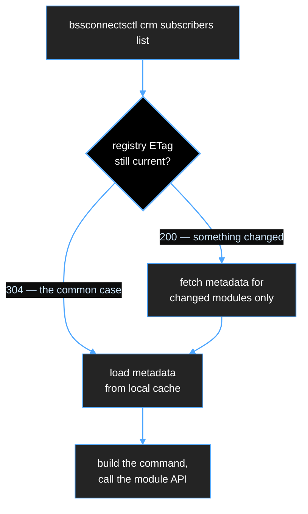

# 09 — BSSConnectsCLI

**Status:** draft
**Binary name:** `bssconnectsctl`
**Related:** [02 — Platform core components](./02-platform-core-components.md),
[`example__metadata__.md`](../example__metadata__.md)

---

## 1. Principles

1. **Anything the UI can do, the CLI can do.** Not a subset. If a capability exists only in
   the UI, that is a bug.
2. **The CLI and the UI Shell share one client library.** The CLI is a thin command-line
   wrapper over it; the Shell imports the same package. One implementation of auth, retries,
   pagination and error handling.
3. **The CLI is a first-class integration surface.** Telco customers will script against it,
   run it in their CI, and wrap it in their own automation. It is part of the product, not
   a debugging tool.
4. **Commands are discovered, not compiled in.** `bssconnectsctl crm subscribers list` works
   because the CRM module declared that resource in its `__metadata__` — not because a
   release of the CLI added CRM support. A module we have not written yet must be
   manageable by a CLI we have already shipped.

---

## 2. On-disk layout

Follow the **XDG Base Directory** specification, with a single override for people who want
everything in one place.

```
$XDG_CONFIG_HOME/bssconnects/        (default ~/.config/bssconnects)      mode 0700
    config.yaml                      contexts, current context, preferences
    credentials.yaml                 only if the OS keyring is unavailable  mode 0600

$XDG_CACHE_HOME/bssconnects/         (default ~/.cache/bssconnects)        mode 0700
    <context>/
        registry.json                module list + versions + metadataRevision
        metadata/
            crm-2.3.1-3.json         one file per module, keyed by revision
            mediation-4.2.0-1.json
        oidc.json                    discovery document + JWKS
        completion.json              precomputed shell-completion index

$XDG_STATE_HOME/bssconnects/         (default ~/.local/state/bssconnects)
    history.log                      optional, opt-in
```

`BSSCONNECTS_HOME=~/.bssconnects` collapses all three into one directory for users who
prefer that, and for locked-down environments where only the home directory is writable.

**Why three directories rather than one `~/.bssconnects`:** the cache is disposable and the
config is not. An operator must be able to `rm -rf` the cache to resolve a stale-metadata
problem without destroying their contexts and credentials. Mixing them makes that
instruction dangerous.

### `config.yaml`

Multiple named contexts, because an engineer routinely works against a lab cluster, a
customer's staging cluster and production in the same afternoon.

```yaml
apiVersion: platform.bssconnects.io/v1alpha1
kind: CLIConfig
currentContext: acme-prod
contexts:
  - name: acme-prod
    server: https://platform.acme.example
    issuer: https://platform.acme.example/realms/platform
    clientId: bssconnectsctl
    defaultTenant: acme
    caFile: /etc/ssl/acme-root.pem       # customer's internal CA
  - name: lab
    server: https://lab.internal
    issuer: https://lab.internal/realms/platform
    clientId: bssconnectsctl
    insecureSkipTlsVerify: false
preferences:
  output: table                          # table | json | yaml | jsonpath
  pageSize: 50
  colour: auto
```

### Credentials

**Never in the cache directory, and never in `config.yaml`.**

Order of preference:
1. **OS keyring** — libsecret on Linux, Keychain on macOS, Credential Manager on Windows.
2. `credentials.yaml`, mode 0600, only when no keyring is available (headless servers,
   containers).
3. `BSSCONNECTS_TOKEN` environment variable, for CI. Documented as the CI path so nobody
   invents something worse.

Stored per context: refresh token and access token with expiry. Access tokens are short
lived; the CLI refreshes silently and re-runs the device flow when the refresh token
expires.

Login uses the **Device Authorization Grant** — the CLI prints a URL and a code, the user
approves in a browser, no redirect listener and no password ever touching the CLI. This
also works over SSH, which the password grant story does not.

---

## 3. Metadata caching

Yes — the CLI must cache the module registry and each module's `__metadata__`. Without it,
every invocation would download the metadata for every installed module before it could
even parse its own arguments, and shell completion would be unusable.

**But do not cache on a timer.** A TTL is either too short (pointless requests) or too long
(a module is upgraded and the CLI silently offers commands that no longer exist). Key the
cache on the same `metadataRevision` the rest of the platform uses.

### The freshness check

Every invocation makes exactly **one** small conditional request:

```
GET /api/platform/v1/registry?view=revisions
If-None-Match: "sha256:8f2c…"

304 Not Modified                     → use the cache, proceed
200 OK  { "crm": "2.3.1-3", … }      → fetch metadata only for changed modules
```

The response is a list of module ids and their revisions — a few hundred bytes, and usually
a `304` with no body at all. Full metadata is downloaded only for modules whose revision
actually moved.



### Rules

- **Cache metadata, never data.** Subscriber records, CDRs and licences are never written to
  disk. The cache holds only descriptions of resources.
- **Cache per context.** Two clusters may run different module versions; a shared cache
  would produce commands that work against one and fail against the other.
- **Do not cache the user's permissions.** The CLI shows all commands the *module* offers and
  lets the server return `403`. Caching a permission set risks acting on a stale grant, and
  the authoritative check is server-side anyway.
- **Escape hatches:** `--refresh` forces revalidation, `bssconnectsctl cache clear`
  discards it, `--offline` skips the freshness check entirely and uses whatever is cached —
  necessary for air-gapped operators and for scripted runs that must not fail on a network
  blip.
- **Cache misses must be silent and safe.** An empty or corrupt cache means one extra
  request, never an error.

### Shell completion

Completion is generated from the cached metadata, so
`bssconnectsctl crm sub<TAB>` completes without a network call, and completion for a module
installed yesterday appears without upgrading the CLI. Regenerated whenever the registry
revision changes.

---

## 4. Command shape

```
bssconnectsctl <module> <resource> <verb> [id] [flags]
bssconnectsctl platform  <resource> <verb> [id] [flags]
```

Derived directly from `__metadata__`:

| From metadata | Becomes |
|---|---|
| `module.id` | the first path segment (`crm`) |
| `names.collection`, `names.cliAliases` | the second (`subscribers`, `sub`, `subs`) |
| `capabilities` | which verbs exist (`list`, `get`, `create`, `update`, `delete`, `export`) |
| `actions[]` | extra verbs (`suspend`, `terminate`) |
| `list.filters`, `x-filterable` | `--filter` keys, validated locally |
| `list.cliColumns` | default table columns |
| `schema.properties` | `--set field=value` flags, with types and validation |
| `docs.summary`, `docs.examples` | `--help` output |
| `permissions` | shown in `--help`; enforcement stays server-side |

```console
$ bssconnectsctl crm subscribers list --filter status=suspended --limit 5
MSISDN          NAME              STATUS
+962791234567   Amal Haddad       suspended
...

$ bssconnectsctl crm subscribers suspend 4711 --reason fraud-review
subscriber/4711 suspended

$ bssconnectsctl platform roles bind NOCOperator --group /noc-team --tenant acme
rolebinding/noc-team-nocoperator created
```

`--output json` on every command, so the CLI composes with `jq` and with customer
automation. Table output is for humans and is explicitly not a stable interface; JSON is.

---

## 5. Open questions

1. Do we ship **plugins** (`bssconnectsctl-<name>` on `PATH`) so customers can extend the
   CLI, or keep the surface closed?
2. Does the CLI need a **`--as` impersonation flag** for support engineers reproducing a
   customer's permission problem? Powerful and dangerous; needs its own audit trail.
3. Should `bssconnectsctl apply -f module.yaml` accept the same CRD YAML the operator
   consumes, giving customers a GitOps-compatible path without teaching them our CRDs?
   (Recommendation: yes — it costs little and it is what platform teams expect.)
4. Distribution in air-gapped sites: static binary in the platform image and downloadable
   from the UI, or a separate artefact in Harbor?
