# 10 — Implementation Plan

**Status:** draft
**Question this answers:** what do we build first, and what can run in parallel?

---

## 1. The sequencing principle

Two artifacts block almost everything else:

1. **The module metadata schema** — `schemas/module-metadata/v1alpha1.json`.
   Consumed by the UI Shell, the CLI, the Authorization Service, the operator and the
   validator. Five consumers cannot start until its shape is fixed.
2. **The API types** — the CRD Go types plus the Platform API's OpenAPI document.
   The operator writes them; the client library, CLI and Shell read them.

Everything else is downstream of those two. So the plan is: **two weeks of contract work
in sequence, then fan out.** Build the contracts first and four workstreams can proceed
without drift; build components first and every integration becomes a renegotiation.

### Why not "operator and client library in parallel"

The client library is a typed wrapper over the Platform API. The Platform API is a facade
over the CRDs. The CRDs are defined by the operator work. Starting the library first means
writing it twice.

The pair that *does* parallelise from day one is **operator** and **UI Shell** — because
the Shell can be built against `example__metadata__.json` as a static mock. It needs no
running backend for weeks. That file is already written; it is the Shell team's entire
input for phase 1.

---

## 2. Repository shape

**One repository, several Go modules.** Early on, a single change routinely touches the
metadata schema, the operator, the CLI and the Shell at once. Across four repositories that
is a four-PR dance with version skew; in one repository it is one commit and one CI run.

It is **not** a single Go module, for two reasons: `web/` has its own toolchain entirely, and
`sdk/` is imported by module teams who must not be forced to pull in controller-runtime and
the whole Kubernetes client. `go.work` ties the modules together during development.

```
nawat/
  go.work                              the Go workspace; committed
  schemas/
    module-metadata/v1alpha1.json      the module contract, as JSON Schema
    platform-api/openapi.yaml          the Platform API contract
  operator/                            MODULE — kubebuilder project
    PROJECT Makefile Dockerfile config/
    api/platform/v1alpha1/             ModuleInstance (namespaced), Module, Platform (cluster)
    api/licensing/v1alpha1/            License
    api/iam/v1alpha1/                  AccessRole, AccessRoleBinding
    internal/controller/<group>/       the reconcilers
    cmd/main.go                        the manager — ALL controllers run in this one process
  sdk/                                 MODULE — what module teams import; tagged separately
    metadata/                          contract types + the ten validation rules
    authz/  license/                   decision and entitlement clients
  cli/                                 MODULE — bssconnectsctl
    cmd/bssconnectsctl/  pkg/client/
  services/                            MODULE — four control-plane binaries
    cmd/<service>/  internal/
  web/                                 npm workspace — shell, design-system
  deploy/charts/platform-core/         the one chart that installs an empty platform
  deploy/policies/                     the Rego bundle — we write it, modules never do
  examples/hello-module/               reference module and conformance target
  test/conformance/  test/e2e/
  hack/                                kind, Tilt, codegen, licence signing
  docs/                                design, ADRs, team guides
```

**Kubebuilder lives in `operator/`, not at the root.** It owns a project root — `PROJECT`,
`config/`, its own `Makefile` and `Dockerfile`. At the repository root those would make the
repo look like an operator project rather than a platform that also holds a React app, a
CLI, four services and Helm charts.

**The dependency arrow points one way:** `operator`, `cli` and `services` all import `sdk`;
`sdk` imports nothing in this repo; nothing imports `operator`. That rule is what keeps the
SDK light enough for a module team to adopt.

Cluster-side manifests and any change applied to a real cluster are recorded in
`~/bss/infrastructure/k8s` with its README change history, per existing practice — the
platform chart lives here, but what we actually deploy is tracked there.

---

## 3. Phase 0 — Contracts and inner loop (~2 weeks)

Sequential. Nothing else starts cleanly until this is done.

| # | Deliverable | Notes |
|---|---|---|
| 0.1 | `schemas/module-metadata/v1alpha1.json` | the spec in `example__metadata__.md`, made machine-readable |
| 0.2 | `pkg/metadata` — Go types + validator | the ten CI rules from `example__metadata__.md` §12 |
| 0.3 | `bssconnectsctl module validate` | the first binary. Small, immediately useful, and it forces 0.1 to be real rather than aspirational |
| 0.4 | `api/v1alpha1` CRD types | `Platform`, `License`, `Module`, `ModuleInstance`, `Role`, `RoleBinding` |
| 0.5 | `schemas/platform-api/openapi.yaml` | endpoint shapes only, no implementation |
| 0.6 | kind cluster + Tilt/Skaffold inner loop | Istio, Keycloak, Flux preinstalled; `tilt up` gives a working platform in minutes |

**Exit test:** `bssconnectsctl module validate example__metadata__.json` passes, and
deliberately corrupting the file produces a precise error.

Writing the validator before the operator is deliberate. It is the cheapest possible forcing
function on the contract, and every later component depends on the contract being right.

---

## 4. Phase 1 — The walking skeleton (~6–10 weeks)

**One vertical slice, end to end, as thin as possible.** Resist building any component
deeply. The goal is a demo, and the demo is the same story as keynote section 3.

```mermaid
%%{init: {'theme':'base','themeVariables':{'background':'#0d0d0d','primaryColor':'#242424','primaryTextColor':'#ffffff','primaryBorderColor':'#4da6ff','lineColor':'#4da6ff','textColor':'#ffffff','clusterBkg':'#171717','clusterBorder':'#4da6ff','edgeLabelBackground':'#0d0d0d','fontSize':'14px'}}}%%
flowchart LR
    L["upload a signed<br/>licence file"]
    A["module appears<br/>as Available"]
    B["install it —<br/>Flux HelmRelease"]
    C["nav entry and<br/>list screen appear"]
    D["change a role —<br/>a button disappears"]

    L --> A --> B --> C --> D

    linkStyle default stroke:#4da6ff,stroke-width:2px,color:#cfe8ff
    classDef out fill:#242424,stroke:#4da6ff,color:#ffffff
    classDef src fill:#000000,stroke:#66b3ff,stroke-width:2px,color:#ffffff
    class L,A,B,C out
    class D src
```



Scope, deliberately minimal:

| Component | Phase-1 scope | Explicitly deferred |
|---|---|---|
| `examples/hello-module` | one resource, ~6 fields, one action, `__metadata__` served | real business logic |
| License Service | verify a real Ed25519/PASETO signature, write `status.entitlements` | quotas, grace periods, runtime SDK |
| Operator | `License` → catalog → `ModuleInstance` → Flux `HelmRelease`; inject `global.platform.*` | dependency resolution, upgrade hooks, capability provisioning |
| Platform API | `GET /registry`, `GET /registry/{module}/metadata`, roles CRUD | everything else |
| Authorization Service | permission catalog import, roles, bindings, **bundle served over HTTP** | OPAL push — polling is fine here |
| OPA | sidecar, one Rego policy, coarse `ext_authz` only | field redaction, partial-eval row filtering |
| UI Shell | login, nav from registry, `ResourceList` + `ResourceDetail`, one action button | forms, micro-frontends, saved views |
| CLI | `login`, `module list/install`, `<module> <resource> list/get` | everything else |
| Keycloak + Istio | realm, PKCE, device grant, `RequestAuthentication` **plus** `AuthorizationPolicy` | federation, theming, ambient mode |

**Exit test — the demo script:**

1. `helm install platform-core` on an empty cluster. Log in. No modules.
2. `bssconnectsctl license apply acme.lic` → hello-module shows as Available.
3. Install it from the UI with a two-field config form.
4. Its nav entry and list screen appear without a redeploy of the Shell.
5. Remove a permission from a role → the action button disappears and the API returns 403.
6. `bssconnectsctl hello widgets list` returns the same data as the screen.

Step 4 is the one that sells the platform. Step 6 is the one that proves the contract.

### Parallel tracks, once Phase 0 is done

| Track | Work | Blocked by | Skillset |
|---|---|---|---|
| **A** | Operator, CRDs, Flux wiring, Helm chart | 0.4 | Go, Kubernetes |
| **B** | Platform API → `pkg/client` → CLI | 0.5 | Go |
| **C** | UI Shell, generic renderers, design system | **0.1 only** — mocks against `example__metadata__.json` | TypeScript, React |
| **D** | Authorization Service, Rego policy, bundle server | 0.1 (permission shape) | Go, Rego |
| **E** | License Service, signing tooling, `hello-module` + SDK | 0.1, 0.4 | Go |

Track C needs no backend for most of Phase 1 — which is why the example metadata file
matters so much. Track B must follow the Platform API definition, not precede it.

**If you are working alone**, run them in this order: A → E → B → D → C, and keep each one
thin. Do not start C before A and E work, or you will have a beautiful UI with nothing
behind it and no demo.

---

## 5. Phase 2 — Make it real (~a quarter)

Now deepen what Phase 1 stubbed:

- OPAL server and clients replacing bundle polling; sub-second revocation
- Fine-grained authorization: field redaction, partial-evaluation list filtering
- Schema-driven **forms** and actions with input schemas
- Micro-frontend loading via Module Federation
- Licence quotas, grace periods, expiry warnings, runtime SDK
- Operator: dependency resolution, capability provisioning (CloudNativePG `Database`,
  Strimzi `KafkaTopic`), generated `HTTPRoute` / `AuthorizationPolicy` / `ServiceMonitor`
- **Conformance suite** in `test/conformance`, plus `module validate` gating CI
- Upgrade and rollback paths, backup/restore, air-gapped install rehearsal

---

## 6. Phase 3 — First real module

Convert one existing product. **Roaming or CRM, not Mediation** — Mediation has the hardest
in-flight-state and upgrade constraints and should not be the product we learn on.

Per-module work: write `__metadata__`, refactor the chart, adopt the SDK, map permissions,
integrate SSO, pass the conformance suite. Expect the first conversion to surface contract
gaps; that is the point of doing it before the second and third.

---

## 7. Risks specific to starting now

| Risk | Mitigation |
|---|---|
| Contract churn after components are built | Phase 0 exists for this; version the schema from day one |
| Phase 1 scope creep — building the operator "properly" | Timebox. A thin slice that demos beats three deep components that do not connect |
| `hello-module` diverging from a real module's needs | Keep it trivial, and treat Phase 3 gaps as expected, not as failure |
| Solo development | Strict sequencing, and thinner slices than feel comfortable |
| Istio + Keycloak + Flux + OPA learning curve landing all at once | Phase 0.6 — get them running in kind before any platform code depends on them |

---

## 8. Immediate next actions

1. Decide the repository location and create the skeleton in §2.
2. Write `schemas/module-metadata/v1alpha1.json` from `example__metadata__.md`.
3. Write `pkg/metadata` and `bssconnectsctl module validate`.
4. Stand up the kind + Tilt inner loop with Istio, Keycloak and Flux.
5. Only then write the first CRD controller.
