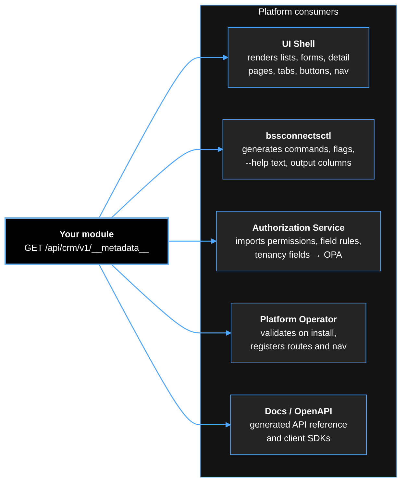
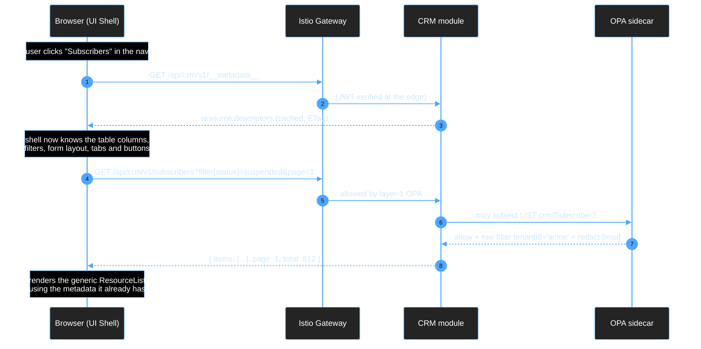
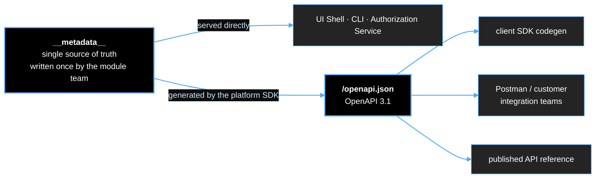

# The `__metadata__` Endpoint — Module Integration Contract

**Companion to:** [`example__metadata__.json`](./example__metadata__.json)
**Status:** draft for review
**Audience:** every team building a module for the bssconnects.io ecosystem

---

## 1. What this is, in one paragraph

Every module exposes **one** endpoint, `GET /api/<module>/<version>/__metadata__`, that
describes its own resources: what fields they have, how they should be listed and edited,
what relations they have to other resources, what actions can be performed on them, and
which permission each of those requires. The platform reads this document and **generates**
the user interface, the CLI commands, the API documentation, and the authorization rules.

The practical consequence: **a module team that ships a correct `__metadata__` document
gets a complete, consistent, permission-aware admin UI without writing a single line of
frontend code.** This is what makes the ecosystem behave like an ERP — install a module,
its screens appear — while every module remains an independent microservice with its own
language, database and release cycle.

---

## 2. Who consumes this document



Five consumers, one document. That is the point: there is exactly one place where a
resource is described, so the UI, the CLI, the permission list and the API reference can
never disagree with each other.

**Design rule for module teams:** if you find yourself about to hardcode something about
your resource into the platform, it belongs in `__metadata__` instead.

---

## 3. Where it sits in the request flow



The metadata document is fetched once per module per session and cached against its
`metadataRevision`/ETag. It is not on the hot path of data requests.

---

## 4. Top-level structure

```jsonc
{
  "apiVersion": "platform.bssconnects.io/v1alpha1",
  "kind": "ModuleMetadata",
  "module":         { ... },   // who am I, where do I live, what conventions do I follow
  "permissions":    [ ... ],   // the flat permission catalog this module contributes
  "suggestedRoles": [ ... ],   // sensible default roles the customer can adopt or ignore
  "navigation":     [ ... ],   // what appears in the left-hand nav when I am installed
  "resources":      [ ... ]    // the meat: one entry per resource type
}
```

| Block | Consumed by | Required |
|---|---|---|
| `module` | all | yes |
| `permissions` | Authorization Service, UI role builder | yes |
| `suggestedRoles` | UI, first-run setup | no |
| `navigation` | UI shell | yes if the module has any UI |
| `resources` | UI, CLI, authz, docs | yes |

---

## 5. `module` — the header block

```jsonc
"module": {
  "id": "crm",                                  // must match the module id in the ModuleDescriptor
  "displayName": "Customer Relationship Management",
  "version": "2.3.1",                           // the running module version
  "apiVersion": "v1",                           // API contract version — changes only on breaking change
  "basePath": "/api/crm/v1",                    // every path below is relative to this
  "category": "BSS",                            // groups modules in the app launcher
  "icon": "users",
  "description": "Manage subscribers, their contracts and billing accounts.",
  "documentationUrl": "https://docs.bssconnects.io/crm/2.3",
  "openApiUrl": "/api/crm/v1/openapi.json",     // generated from this same document
  "metadataRevision": "2.3.1-3",                // bump on ANY metadata change; drives cache invalidation
  "conventions": {
    "envelope": "platform.v1",
    "errorFormat": "rfc7807",
    "pagination": "page-size",
    "filterSyntax": "platform.filter.v1"
  },
  "requiresLicenseFeatures": ["contracts"]      // resources gated by license features
}
```

**`metadataRevision` matters more than it looks.** The shell caches metadata aggressively.
If you change a column and forget to bump this, customers see the old UI until their next
login. Generate it from a hash of the document in your build.

**`conventions`** is a declaration that you implement the standard envelope, error format,
pagination and filter syntax (§11). It exists so the platform can reject a non-conforming
module at install time rather than producing a broken UI at runtime. There is currently
exactly one valid value for each — future versions may add alternatives.

---

## 6. `permissions` — the permission catalog

```jsonc
"permissions": [
  { "id": "crm:subscriber:read", "displayName": "View subscribers",
    "description": "Read and list subscriber records.", "implies": [] },
  { "id": "crm:subscriber:write", "displayName": "Edit subscribers",
    "description": "Create and update subscriber records.",
    "implies": ["crm:subscriber:read"] }
]
```

**Format: `<module>:<resource>:<action>`.** The module segment must equal `module.id` — the
Authorization Service rejects a module trying to declare permissions in another module's
namespace. The `platform:` prefix is reserved for core.

**`displayName` and `description` are not decoration.** They are the labels a customer's
security officer reads in the role builder when deciding what to grant. Write them for that
person, not for a developer.

**`implies` builds the hierarchy.** Granting `write` grants `read` transitively; the role
builder shows this so an admin does not have to tick both. Keep the graph acyclic — CI
rejects cycles.

### Keep the list short — this is the most common mistake

An earlier draft of the CRM metadata declared sixteen permissions for one resource:
`read`, `list`, `search`, `export`, `import`, `read-owner`, `delete-owner`, `read-creater`,
`delete-creater`, and so on. Do not do this. It produces a role builder no human can use,
and most of those distinctions are not permissions at all:

| Tempting permission | What it actually is | Where it belongs |
|---|---|---|
| `list` separate from `read` | the same capability | one `read` permission |
| `search` separate from `read` | the same capability | one `read` permission |
| `read-owner` / `read-own` | a **scope** on the role binding | `RoleBinding.scope`, and `authorization.ownerField` |
| `read-creater` | a scope | same |
| viewing IMSI vs viewing name | a **field rule** | `authorization.fieldRules` |
| suspend vs terminate | genuinely different actions | one permission each — this one is correct |

**Rule of thumb: one permission per verb the customer would reason about separately, plus
one per non-CRUD action, plus one per restricted field group.** For a typical resource that
is four to seven permissions. Anything approaching double digits means scopes are being
modelled as permissions.

---

## 7. `resources[]` — the core of the document

Each entry describes one resource type. The blocks:

```mermaid
%%{init: {'theme':'base','themeVariables':{'background':'#0d0d0d','primaryColor':'#242424','primaryTextColor':'#ffffff','primaryBorderColor':'#4da6ff','lineColor':'#4da6ff','textColor':'#ffffff','clusterBkg':'#171717','clusterBorder':'#4da6ff','edgeLabelBackground':'#0d0d0d','fontSize':'14px'}}}%%
flowchart TD
    R["<b>resource</b><br/>type: crm/Subscriber"]
    R --> N["<b>names</b><br/>singular, plural, collection<br/>cliAliases"]
    R --> D["<b>docs</b><br/>summary, description,<br/>worked examples"]
    R --> I["<b>identity</b><br/>idField, displayField,<br/>alternateKeys"]
    R --> P["<b>paths</b> + <b>capabilities</b><br/>where it lives, which verbs exist"]
    R --> PE["<b>permissions</b><br/>verb → permission id"]
    R --> A["<b>authorization</b><br/>tenancy, ownership,<br/>field rules, list filtering"]
    R --> S["<b>schema</b><br/>JSON Schema 2020-12<br/>+ x- extensions"]
    R --> L["<b>list</b><br/>columns, filters, search,<br/>sort, saved views"]
    R --> DT["<b>detail</b><br/>tabs, sections, layout"]
    R --> REL["<b>relations</b><br/>links to other resources"]
    R --> ACT["<b>actions</b><br/>non-CRUD operations"]
    R --> EV["<b>events</b><br/>what I publish to Kafka"]

    N -.->|"drives"| CLI1["CLI command names"]
    S -.->|"drives"| UI1["forms + validation"]
    L -.->|"drives"| UI2["the table screen"]
    DT -.->|"drives"| UI3["the record screen"]
    A -.->|"drives"| OPA1["OPA data + Rego input"]
    PE -.->|"drives"| OPA1

    linkStyle default stroke:#4da6ff,stroke-width:1.5px,color:#cfe8ff
    classDef src fill:#000000,stroke:#66b3ff,stroke-width:2px,color:#ffffff
    classDef out fill:#242424,stroke:#4da6ff,color:#ffffff
    classDef drv fill:#1a1a1a,stroke:#4da6ff,stroke-dasharray:4 3,color:#9fc9ee
    class R src
    class N,D,I,P,PE,A,S,L,DT,REL,ACT,EV out
    class CLI1,UI1,UI2,UI3,OPA1 drv
```



### 7.1 `type`, `names`

```jsonc
"type": "crm/Subscriber",              // globally unique: <module>/<PascalSingular>
"names": {
  "singular": "Subscriber",
  "plural": "Subscribers",
  "collection": "subscribers",         // the URL path segment
  "cliAliases": ["sub", "subs"]        // bssconnectsctl crm sub list
}
```

`type` is the identifier used everywhere else — in relations, in OPA input, in audit logs,
in event payloads. Singular, PascalCase. **Not** `Subscribers` — a type names one thing.

### 7.2 `docs` — where your CLI help and your API reference come from

```jsonc
"docs": {
  "summary": "A person or organisation holding one or more mobile lines.",
  "description": "Subscribers are the central record in CRM. Every contract, invoice and SIM provisioning request is linked to exactly one subscriber...",
  "url": "https://docs.bssconnects.io/crm/2.3/subscribers",
  "examples": [
    {
      "title": "Find suspended subscribers created this month",
      "cli":  "bssconnectsctl crm subscribers list --filter status=suspended --filter createdAt>=2026-08-01",
      "http": "GET /api/crm/v1/subscribers?filter[status]=suspended&filter[createdAt][gte]=2026-08-01"
    }
  ]
}
```

This is what `bssconnectsctl crm subscribers --help` prints. Because it is generated, the
CLI documents modules that did not exist when the CLI was built, and the help can never
drift from the implementation. Field-level help comes from each property's `description`.

### 7.3 `identity`

```jsonc
"identity": {
  "idField": "id",                        // the primary key, used in {id} paths
  "displayField": "name",                 // shown in breadcrumbs, reference pickers, audit logs
  "secondaryDisplayField": "msisdn",      // the muted second line under displayField
  "alternateKeys": ["msisdn", "imsi"]     // GET /subscribers/msisdn:+96279... also resolves
}
```

`displayField` is what other modules show when they reference your resource. Without it,
a billing invoice would display `subscriberId: 8f2c-…` instead of a name.

### 7.4 `paths` and `capabilities`

```jsonc
"paths":  { "collection": "/subscribers", "item": "/subscribers/{id}" },
"capabilities": {
  "list": true, "get": true, "create": true, "update": true, "patch": true,
  "delete": true, "bulkDelete": false,
  "export": ["csv", "json"], "import": ["csv"],
  "watch": true,        // supports server-sent events / websocket for live tables
  "audit": true         // supports GET /subscribers/{id}/_audit
}
```

**Do not enumerate standard endpoints.** An earlier draft listed every endpoint with its
method, query parameters and response schema. That is redundant: the platform *defines* the
standard verbs and their query syntax, so declaring `"list": true` tells every consumer
everything it needs. Enumerating them by hand means the shell must interpret arbitrary
paths, which defeats the purpose of a generic renderer, and it is a guaranteed source of
drift between the document and the implementation.

Only genuinely non-standard operations are enumerated — under `actions` (§7.9).

`capabilities` directly controls the UI: `"delete": false` removes the delete button and
the bulk-delete checkbox column; `"export": []` removes the export menu; `"watch": true`
makes the table auto-refresh.

### 7.5 `permissions` — verb mapping

```jsonc
"permissions": {
  "list": "crm:subscriber:read",
  "get": "crm:subscriber:read",
  "create": "crm:subscriber:write",
  "update": "crm:subscriber:write",
  "delete": "crm:subscriber:delete",
  "export": "crm:subscriber:export"
}
```

Maps each capability to a permission id from the module's catalog. The UI uses this to hide
buttons the user cannot use; OPA uses it to decide requests. **Both sides use the same
mapping**, which is why a hidden button and a 403 can never disagree.

### 7.6 `authorization` — what OPA needs from you

```jsonc
"authorization": {
  "tenantField": "tenantId",          // which field carries the tenant — enables multi-tenancy scoping
  "ownerField": "ownerUserId",        // enables "only records I own" scopes
  "selfField": "userId",              // enables self-service: a subscriber sees only their own record
  "listFiltering": "partial-eval",    // how LIST is constrained: partial-eval | client-filter | none
  "fieldRules": [
    { "fields": ["imsi", "nationalId", "iccid"],
      "requires": "crm:subscriber:pii", "onDeny": "redact" },
    { "fields": ["creditScore"],
      "requires": "crm:subscriber:pii", "onDeny": "omit" }
  ]
}
```

This block is the bridge between your data model and the platform's authorization engine.

**`listFiltering: "partial-eval"`** is the important one and needs explaining. A LIST
request is not a yes/no question — the answer is "these rows, not those". OPA answers it by
**partial evaluation**: instead of returning `allow: true`, it returns a residual condition
such as `tenantId = "acme" AND ownerUserId = "u-9f3c"`. Your module translates that residual
into a `WHERE` clause. The platform SDK does this translation for you if you use its query
builder; if you hand-roll it, you must implement the translation, and CI will test it with
a conformance suite. The alternative values are `client-filter` (fetch then filter in the
module — correct but slow, acceptable for small collections) and `none` (the resource is
not row-scoped at all, e.g. a global tariff catalogue).

**`fieldRules`** is what makes "a support agent sees the name but not the IMSI" work. The
same rules are enforced server-side by the OPA sidecar (`redact` replaces the value with
`null` plus a `_redacted: ["imsi"]` marker; `omit` removes the key entirely) **and** applied
client-side by the shell to hide the field in tables and forms. Declaring it once means the
UI and the API can never disagree.

### 7.7 `schema` — JSON Schema 2020-12 with `x-` extensions

The field definitions. This must be **valid JSON Schema**, because it is used for real
validation on both sides, and because it is lifted verbatim into the generated OpenAPI
document (OpenAPI 3.1 uses JSON Schema 2020-12 natively).

```jsonc
"msisdn": {
  "type": "string",
  "title": "MSISDN",                              // the form label and column header
  "description": "Mobile number in E.164 format.", // the help tooltip and CLI flag help
  "pattern": "^\\+[1-9][0-9]{6,14}$",             // validated in the browser AND on the server
  "x-searchable": true,
  "x-filterable": true,
  "x-sortable": true,
  "x-ui": { "widget": "msisdn", "placeholder": "+9627xxxxxxxx" }
}
```

**All non-standard keywords must be `x-` prefixed.** An earlier draft used bare
`searchable`, `sensitive`, `filterable` alongside `type` and `description`. That makes the
schema unvalidatable by any standard JSON Schema library — which matters, because we *do*
validate these documents in CI, and a silently-broken schema means a silently-broken screen.

Supported extensions:

| Keyword | Effect |
|---|---|
| `x-searchable` | field is included in the free-text `?q=` search |
| `x-filterable` | field can appear in the filter bar and `?filter[...]` |
| `x-sortable` | column header is clickable, `?sort=` accepts it |
| `x-sensitive` | never logged, masked by default in the UI, excluded from exports unless permitted |
| `x-permission` | viewing this single field requires the named permission (shorthand for a one-field `fieldRule`) |
| `x-ui.hidden` | present in the API, never rendered (e.g. `tenantId`) |
| `x-ui.widget` | which input component to use — see below |
| `x-ui.optionsFrom` | populate a dropdown from another resource, possibly in another module |
| `x-ui.enumLabels` / `enumColors` | human labels and badge colours for an `enum` |
| `x-immutable` | settable on create, read-only afterwards |
| `x-transitions` | the field's value is changed only by `actions`, never by direct edit |

Standard JSON Schema keywords you should use rather than inventing extensions:
`readOnly`, `writeOnly`, `default`, `enum`, `format`, `minLength`, `maximum`, `required`,
`deprecated`.

**Widgets.** `text` (default), `textarea`, `number`, `date`, `datetime`, `select`,
`multiselect`, `reference`, `tags`, `checkbox`, `password`, `code`, `json`, `duration`,
`country`, `msisdn`, `imsi`, `ipaddress`, `cron`, `file`. If your field needs something not
on this list, register a custom widget from your module's micro-frontend and name it here —
the shell falls back to a plain text input if the custom component is unavailable, so the
screen degrades rather than breaking.

**Reference fields** are how the generic UI crosses module boundaries:

```jsonc
"accountManagerId": {
  "type": "string", "title": "Account manager",
  "x-ui": { "widget": "reference",
            "optionsFrom": { "resource": "platform/User",
                             "valueField": "id", "labelField": "displayName" } }
}
```

The shell resolves `platform/User` through the registry of installed modules, calls its
list endpoint with a search term as the user types, and renders a picker. Your module never
knows how users are stored.

### 7.8 `list` and `detail` — the two generated screens

```jsonc
"list": {
  "columns": [
    { "field": "msisdn", "width": 160 },
    { "field": "name" },
    { "field": "status" },
    { "field": "createdAt", "width": 180 }
  ],
  "defaultSort": "-createdAt",
  "defaultPageSize": 50,
  "search": { "fields": ["msisdn","name","email","imsi"],
              "placeholder": "Search by number, name or email" },
  "filters": [
    { "field": "status",    "type": "enum", "multiple": true },
    { "field": "createdAt", "type": "dateRange" }
  ],
  "savedViews": [
    { "id": "suspended", "label": "Suspended lines", "filter": { "status": ["suspended"] } }
  ],
  "rowActions": ["suspend", "unsuspend"],   // action ids, shown in the row's ⋯ menu
  "bulkActions": ["export"],
  "cliColumns": ["msisdn", "name", "status"] // narrower default for terminal output
}
```

**Every `field` referenced here must exist in `schema.properties`.** CI enforces this; a
column pointing at a field that was renamed is the single most common cause of a blank cell
in production.

```jsonc
"detail": {
  "titleTemplate": "{{name}}",
  "subtitleTemplate": "{{msisdn}}",
  "statusField": "status",                  // rendered as a badge next to the title
  "tabs": [
    { "id": "profile", "title": "Profile", "renderer": "form",
      "sections": [
        { "title": "Identity",   "fields": ["name","email","msisdn","imsi"], "columns": 2 },
        { "title": "Commercial", "fields": ["segment","accountManagerId","tags"], "columns": 2 },
        { "title": "Address",    "fields": ["address"], "columns": 1 }
      ] },
    { "id": "contracts", "title": "Contracts", "renderer": "relation", "relation": "contracts" },
    { "id": "invoices",  "title": "Invoices",  "renderer": "relation", "relation": "invoices",
      "requires": "billing:invoice:read", "hideIfModuleAbsent": "billing" },
    { "id": "usage",     "title": "Usage",     "renderer": "microfrontend",
      "component": { "remote": "crm", "module": "./SubscriberUsage" } },
    { "id": "audit",     "title": "History",   "renderer": "audit" }
  ]
}
```

Four tab renderers, and this is the escalation ladder for module teams:

| `renderer` | Use when | Code you write |
|---|---|---|
| `form` | ordinary field editing | none |
| `relation` | a list of related records | none |
| `audit` | change history | none — implement `GET /{id}/_audit` |
| `microfrontend` | genuinely bespoke interaction | a federated React component |

**`hideIfModuleAbsent`** is what keeps cross-module integration graceful. CRM can offer an
Invoices tab that simply does not exist at a customer who has not licensed Billing — no
error, no broken tab, no conditional code in CRM.

### 7.9 `relations`

```jsonc
"relations": {
  "contracts": {
    "target": "crm/Contract",
    "cardinality": "many",
    "path": "/subscribers/{id}/contracts",
    "foreignField": "subscriberId",
    "requires": "crm:contract:read",
    "inlineCreate": true                     // show an "Add contract" button in the tab
  },
  "invoices": {
    "target": "billing/Invoice",
    "cardinality": "many",
    "module": "billing",                     // lives in another module
    "path": "/api/billing/v1/invoices?filter[subscriberId]={id}",
    "requires": "billing:invoice:read",
    "optional": true                         // absent if billing is not installed
  }
}
```

The relation tab reuses the **target resource's own `list` configuration** — so the
Contracts tab inside a subscriber looks like the Contracts screen, with the same columns and
row actions, without CRM redefining any of it.

### 7.10 `actions` — everything that is not CRUD

```jsonc
{
  "id": "suspend",
  "label": "Suspend",
  "description": "Suspend all services for this subscriber.",
  "method": "POST",
  "path": "/subscribers/{id}:suspend",
  "permission": "crm:subscriber:suspend",
  "scope": "item",                                    // item | collection | bulk
  "availableWhen": { "field": "status", "in": ["active"] },
  "confirm": { "required": true, "title": "Suspend subscriber?", "danger": true },
  "inputSchema": {
    "type": "object", "required": ["reason"],
    "properties": {
      "reason": { "type": "string", "title": "Reason",
                  "enum": ["non-payment","fraud-review","customer-request"] },
      "note":   { "type": "string", "title": "Note", "x-ui": { "widget": "textarea" } }
    }
  },
  "cli": "bssconnectsctl crm subscribers suspend <id> --reason <reason>"
}
```

From this the shell renders a button, disables it unless `status` is `active`, hides it
entirely without `crm:subscriber:suspend`, opens a modal generated from `inputSchema` with
a red confirm, and calls the endpoint. The CLI derives `bssconnectsctl crm subscribers
suspend 4711 --reason fraud-review` from the same definition.

**Path convention:** `POST /collection/{id}:verb` — the colon separates the resource from
the action, so an action can never collide with a sub-resource path.

**Long-running actions** declare `"async": { "resultResource": "platform/Job" }`. The
endpoint returns `202` with a job id; the shell shows a progress toast and links to the
platform's job viewer. No module implements its own progress UI.

### 7.11 `events`

```jsonc
"events": [
  { "type": "crm.subscriber.suspended.v1", "topic": "crm.subscriber",
    "description": "Emitted when a subscriber is suspended." }
]
```

Declares what you publish to the platform's Kafka backbone. The operator uses this to create
topics and ACLs; the UI uses it to offer webhook and notification rules; other modules use it
to discover integration points. Consumed events are declared in the `ModuleDescriptor`, not
here — `__metadata__` describes what you *offer*.

---

## 8. `navigation`

```jsonc
"navigation": [{
  "id": "crm", "label": "CRM", "icon": "users", "order": 200,
  "children": [
    { "id": "crm.subscribers", "label": "Subscribers",
      "resource": "crm/Subscriber", "requires": "crm:subscriber:read" },
    { "id": "crm.churn", "label": "Churn Analysis", "route": "/crm/churn",
      "requires": "crm:subscriber:read", "renderer": "microfrontend",
      "component": { "remote": "crm", "module": "./ChurnDashboard" } }
  ]
}]
```

A nav item either points at a `resource` (generic screens, no code) or at a `route` with a
`renderer` of `microfrontend` (custom screen). Items the user lacks permission for are not
rendered; a parent with no visible children disappears. `order` reserves nav position —
coordinate ranges across modules so installation order does not shuffle the menu.

---

## 9. Relationship to OpenAPI

**Do not replace `__metadata__` with OpenAPI, and do not maintain both by hand.**

OpenAPI describes *operations* — paths, verbs, request and response bodies. It has no
vocabulary for "this field is a status badge coloured green when active", "this tab shows a
relation", "this action requires this permission and is only available in this state". You
would end up expressing all of that in `x-` extensions anyway, at which point OpenAPI is a
lossy wrapper around this document.

The correct relationship:



Because OpenAPI 3.1 uses JSON Schema 2020-12 natively, the `schema` blocks in this document
are lifted **byte-identical** into OpenAPI `components/schemas`. The platform SDK emits both
artefacts from one definition; `module.openApiUrl` links them.

---

## 10. Versioning and compatibility

| Change | Requires | Notes |
|---|---|---|
| add an optional field | bump `metadataRevision` | safe |
| add a column, filter, action, tab | bump `metadataRevision` | safe |
| add a permission | bump `metadataRevision` | safe — not granted to anyone until an admin adds it to a role |
| make an optional field required | **new `apiVersion`** | breaks existing clients |
| rename or remove a field | **new `apiVersion`** | mark `"deprecated": true` for at least one minor release first |
| remove a permission | **new `apiVersion`** | orphans customer role definitions — the operator must supply a migration mapping |
| change a permission id | **new `apiVersion`** + migration mapping | never do this silently; customers lose access without warning |

The platform can serve two `apiVersion`s of a module concurrently during a migration
window. Permission removals and renames are the dangerous class of change, because customer
role definitions reference them by id: the module must ship a `permissionMigrations` block
in its `ModuleDescriptor` so the Authorization Service can rewrite existing bindings.

---

## 11. The conventions your API must satisfy

`__metadata__` describes your resources; these conventions describe how they are accessed.
Both are mandatory. The platform SDKs (Go, Java, Node) implement all of this — use them
rather than reimplementing.

**Query syntax**

```
GET /api/crm/v1/subscribers
      ?q=0791                          free-text over x-searchable fields
      &filter[status]=active           equality
      &filter[status]=suspended        repeated key means OR
      &filter[createdAt][gte]=2026-08-01
      &filter[tags][contains]=vip
      &sort=-createdAt,name            leading '-' is descending
      &page=2&pageSize=50
      &fields=id,msisdn,name           sparse response
```

Operators: `eq` (default), `ne`, `gt`, `gte`, `lt`, `lte`, `in`, `contains`, `startsWith`,
`isNull`.

**Response envelope**

```jsonc
{
  "items": [ ... ],
  "page": 2, "pageSize": 50, "total": 812,
  "_redacted": ["imsi"]        // fields removed by authorization, so the UI can explain why
}
```

Single-resource responses return the object directly, not wrapped.

**Errors — RFC 7807**

```jsonc
{
  "type": "https://errors.bssconnects.io/crm/subscriber-msisdn-taken",
  "title": "MSISDN already assigned",
  "status": 409,
  "detail": "+962791234567 belongs to subscriber 4711.",
  "instance": "/api/crm/v1/subscribers",
  "errors": [ { "field": "msisdn", "message": "Already in use" } ]   // maps onto form fields
}
```

The `errors[].field` array is what lets the generic form highlight the offending input
instead of showing a toast.

**Required auxiliary endpoints**

| Endpoint | Purpose |
|---|---|
| `GET /__metadata__` | this document |
| `GET /openapi.json` | generated OpenAPI 3.1 |
| `GET /healthz`, `/readyz` | probes |
| `GET /metrics` | Prometheus |
| `GET /{collection}/{id}/_audit` | if `capabilities.audit` is true |

---

## 12. Validation and CI

A module cannot be published to Harbor unless its metadata passes:

```bash
bssconnectsctl module validate --metadata ./__metadata__.json
```

The validator checks, at minimum:

1. Document validates against the `ModuleMetadata` JSON Schema.
2. Every `schema` block is valid JSON Schema 2020-12.
3. Every field referenced in `list.columns`, `list.filters`, `list.search`,
   `detail.sections`, `identity.*` and `authorization.*` exists in `schema.properties`.
4. Every permission referenced in `permissions`, `actions`, `relations` and `navigation`
   exists in the module's `permissions` catalog.
5. All permission ids are prefixed with `module.id`.
6. `implies` graph is acyclic.
7. Relation targets resolve — within the module, or are marked `optional` if cross-module.
8. Action ids referenced in `list.rowActions` / `bulkActions` exist.
9. `metadataRevision` changed if the document changed (compared against the previous tag).
10. Declared `capabilities` match the routes the SDK actually registered (runtime check in
    the module's own test suite).

A **conformance test suite** ships with the SDK: point it at a running module and it
exercises pagination, filter operators, error format, field redaction and partial-eval list
filtering against the declared metadata. Passing it is the definition of "integrates with
the ecosystem".

---

## 13. Checklist for a module team

- [ ] One `__metadata__` endpoint, served from the same process as the API.
- [ ] Four to seven permissions per resource — scopes and field rules are *not* permissions.
- [ ] `authorization` block filled in: tenant field, owner field, list filtering strategy.
- [ ] Every restricted field covered by `x-permission` or a `fieldRule`.
- [ ] `docs.examples` written for the two or three things people actually do with the resource.
- [ ] `title` and `description` on every property — they are the UI labels and CLI help.
- [ ] All custom keywords `x-` prefixed; schema validates as JSON Schema 2020-12.
- [ ] No hand-enumerated standard endpoints; only real `actions`.
- [ ] `metadataRevision` generated from a content hash in the build.
- [ ] `bssconnectsctl module validate` green in CI.
- [ ] Conformance suite green against a running instance.
- [ ] Custom micro-frontends used only where `form` / `relation` / `audit` genuinely cannot
      express the interaction.

---

## 14. Open questions

1. Should `__metadata__` be **served by the module at runtime**, **published as an OCI
   artifact alongside the chart**, or both? Runtime serving keeps it honest (it cannot drift
   from the running code); the OCI artifact lets the platform show a module's screens in the
   catalogue *before* installation. Recommendation: both, with the runtime version
   authoritative and CI asserting they match.
2. Do we support **customer-defined custom fields** on a resource (an ERP staple)? This
   requires the module to persist an extension map and merge customer field definitions into
   its schema at request time. Powerful, and a large commitment — propose deferring to v2.
3. How are **i18n labels** carried — inline per locale, or a separate bundle per module
   fetched by the shell? Recommendation: separate bundles keyed by the `title` strings, so
   the metadata document stays readable.
4. Does `listFiltering: "partial-eval"` become **mandatory** for all row-scoped resources, or
   may a module opt for `client-filter` at small scale and accept the performance ceiling?
