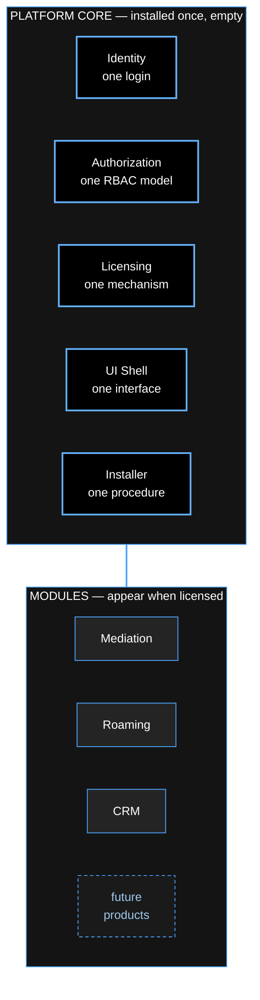
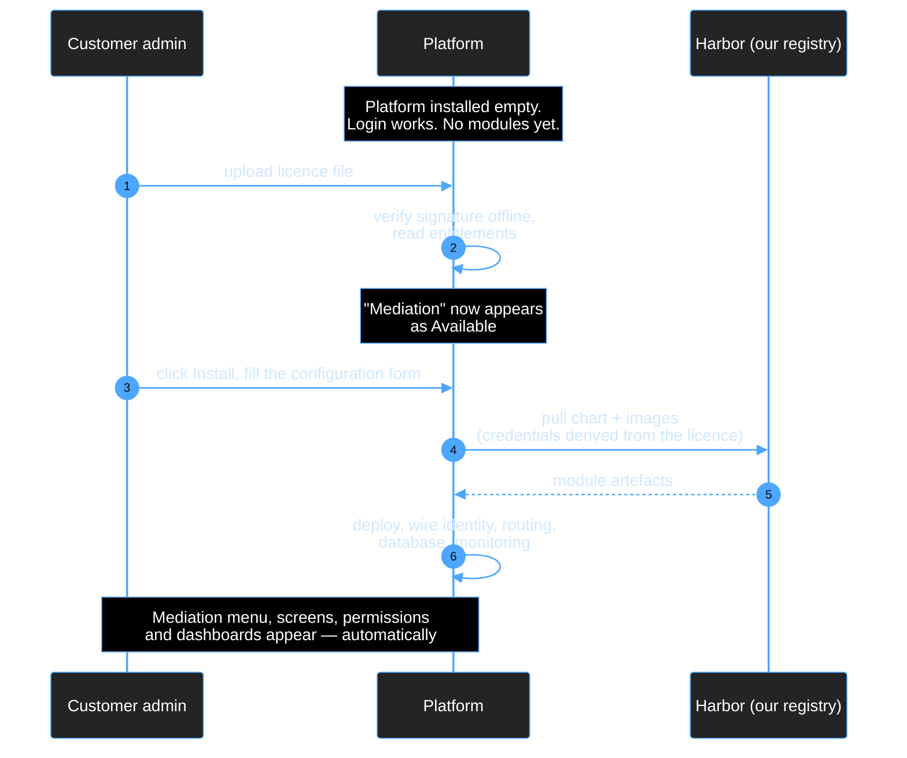
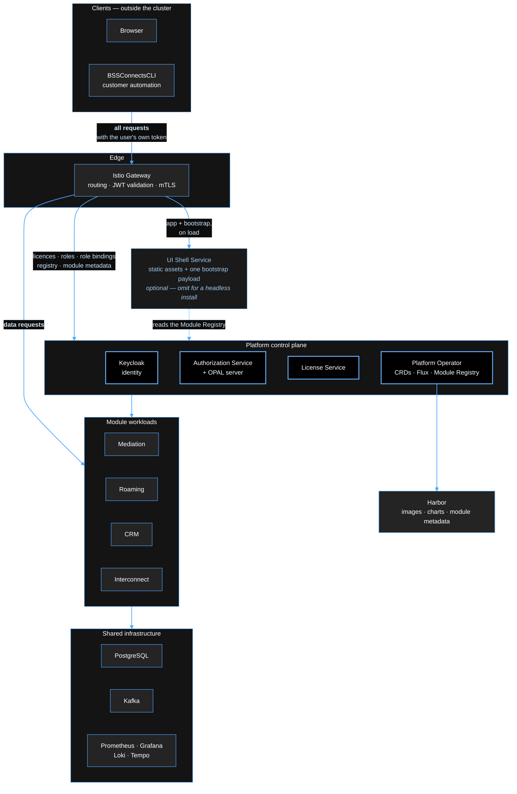
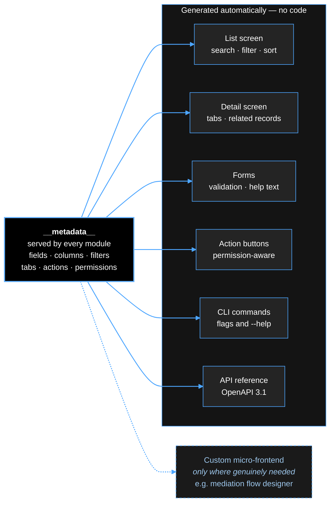
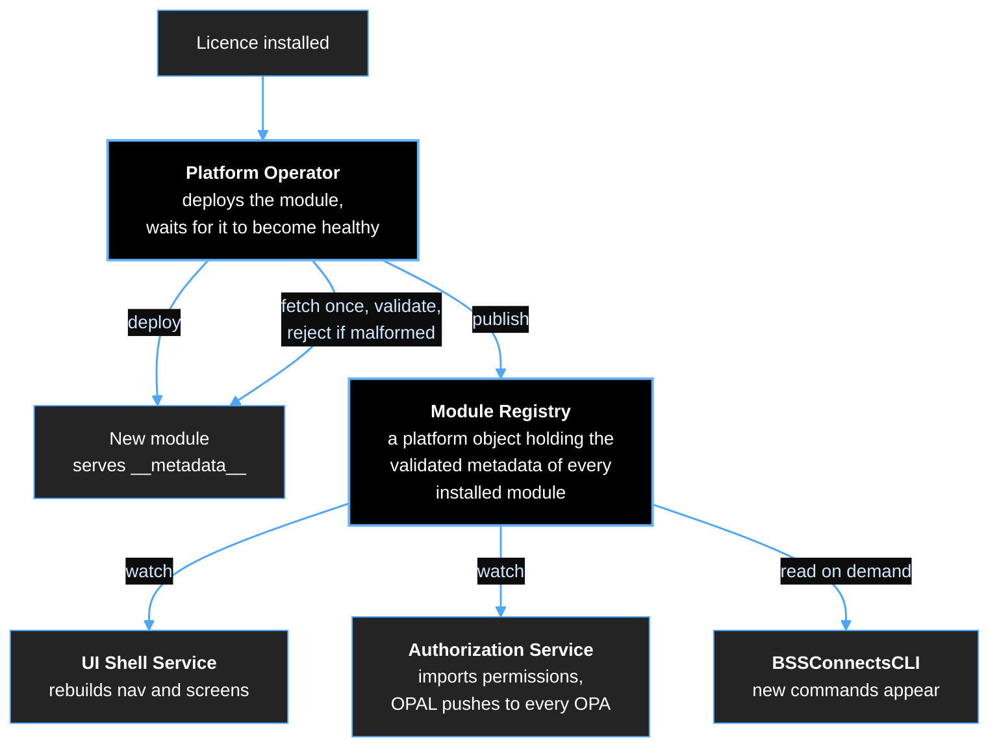
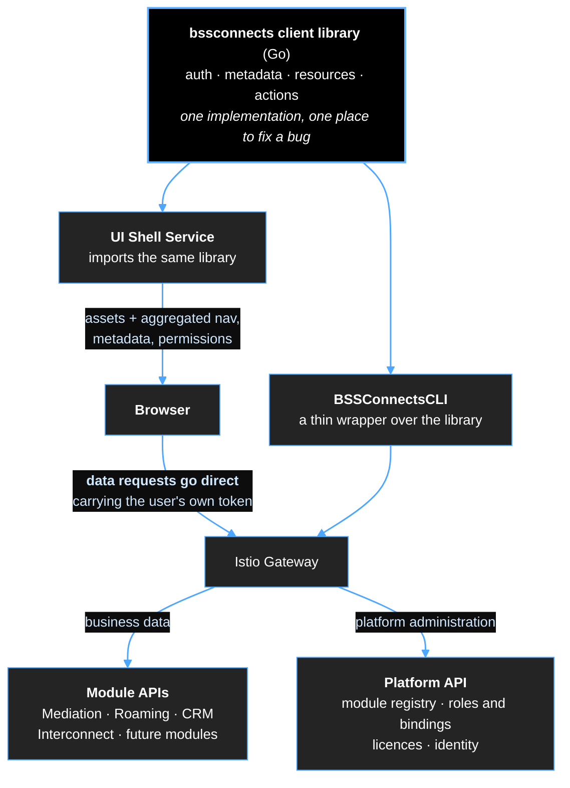
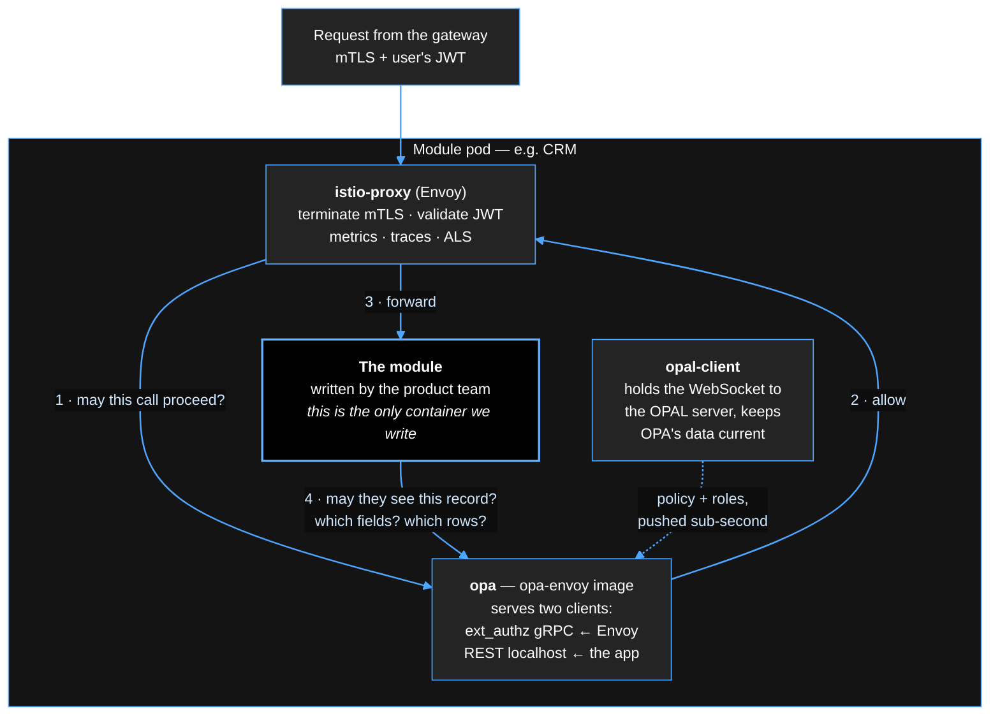
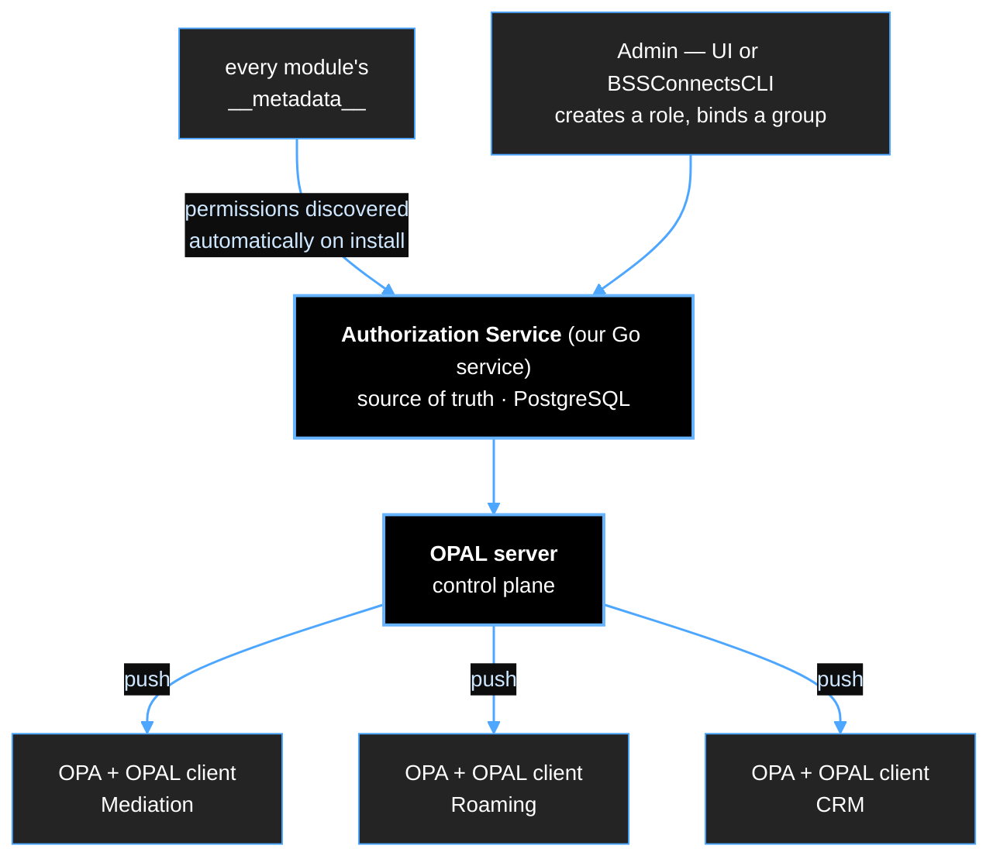
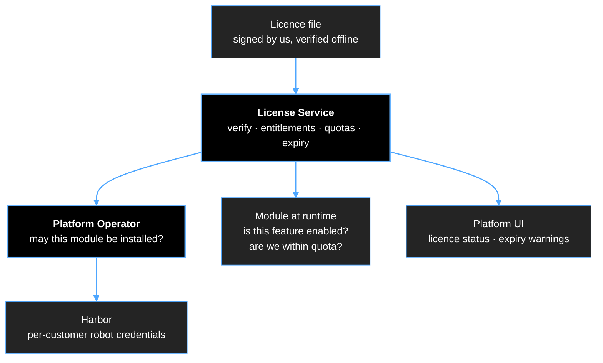

# bssconnects.io — Unified Platform

### High-level design concept

*Speaking notes — one section per slide*

---

## 1 — The problem we are solving

Today we sell three products. Each one has:

- its own login and its own user list
- its own idea of roles and permissions
- its own UI, look and navigation
- its own install procedure and its own licence handling

For the customer that is three products. For us it is three of everything to build,
document, support and train — and a fourth product means a fourth of everything.

**The goal:** one platform, one login, one UI, one permission model, one licence
mechanism. Products become **modules** that plug into it. Like an ERP — install a module,
its screens appear — but built as microservices on Kubernetes.

---

## 2 — The core idea



**The rule that makes it work:** Platform Core must never contain the word "Mediation".
If core has to be changed to add a product, we have not built a platform — we have built
a bigger monolith.

---

## 3 — What the customer experiences



No engineer on site. No separate installer. No new user accounts.
**The licence is the switch.**

---

## 4 — The component stack



Every component is open source, runs offline, and can be installed air-gapped —
mandatory for telco.

**Three things to point out on this slide:**

**Everything enters through the gateway.** Browser and CLI use the same door, the same
token, the same authorisation. The control plane's own APIs — licences, roles, Keycloak —
are reached the same way as a module's API. There is no privileged back channel.

**The UI Shell Service sits beside the modules, not in front of them.** The gateway routes
to either the Shell (for the application) or a module (for data) — nothing passes through
the Shell to reach CRM or Mediation. It is drawn outside the control plane because of a
simple test: if a component is down, does the platform lose a *capability* or just a
*face*? Keycloak down means nobody logs in at all. The Operator down means nothing can be
installed. The Shell down means only the browser UI is unavailable — modules keep running,
the CLI works completely, licences still validate, RBAC still enforces. It holds no state,
owns no CRDs and makes no decisions. Dashed, because a headless install can omit it.

**The Shell is not in the data path.** It serves the application and one bootstrap payload
per session. Every list, search and action goes from the browser straight through the
gateway to the module.

---

## 5 — Identity: Keycloak

- **Authorization Code + PKCE** for the browser, with a **custom theme** so the login
  page is ours — the customer never sees a Keycloak screen.
- **Device Authorization Grant** for BSSConnectsCLI — no redirect needed at a terminal.
- **Client Credentials** for service-to-service and CI.
- MFA, LDAP/AD and SAML federation available without us writing any of it.

**The JWT carries identity, not permissions:**

```json
{
  "sub": "9f3c…",
  "preferred_username": "amal",
  "email": "amal@operator.example",
  "groups": ["/noc-team", "/tenant-a"],
  "tenant": "tenant-a",
  "aud": "platform",
  "exp": 1770000000
}
```

*Why this matters:* with twenty modules installed, a token holding every permission
becomes too large for an HTTP header — and a permission revoked at 10:00 would keep
working until the token expires. Permissions are resolved per request instead, so
**revocation takes effect in under a second.**

### We do not manage the customer's users

Their staff already exist in their LDAP or Active Directory. Keycloak federates to it, and
the platform consumes the result — we never become a second place where a leaver has to be
deleted. Note the `groups` claim above: **role bindings attach to groups, not to
individuals.** The customer manages membership where they already manage it, and the
platform only decides what a group is allowed to do.

So platform RBAC administration is **roles and role bindings** — not user accounts.

Three cases still need identities the customer's directory does not hold, and Keycloak
covers all three without us building user management:

- **service accounts** for automation, CI and module-to-module calls
- **local accounts** for customers with no directory, plus a break-glass admin
- **end customers** — a subscriber logging in to self-care is not in the operator's
  corporate LDAP, and belongs in a separate realm with its own registration flow

---

## 6 — BSSConnectsCLI

**Principle: anything the UI can do, the CLI can do.** Not a subset — the same operations.

- Build the **CLI and its client library first**; the UI is another consumer of the same
  API. One code path, two interfaces, no feature drift.
- Automation, scripting, CI/CD, and customer integration — telcos will demand this.
- Manages tenants, users, groups, roles, licences, modules and platform configuration.
- Because the platform's API is Kubernetes CRDs, the CLI, the UI and a customer's own
  GitOps pipeline are all writing to the same objects.

*How "the UI uses the CLI under the hood" is actually built — see section 7c.*

---

## 7 — UI: no frontend code per module

This is the part that makes the ecosystem feel like one product.



- Roughly **75% of all screens are list / search / open / edit / act** — those are
  generated from the module's own `__metadata__` document.
- The remaining ~25% that are genuinely domain-specific are hand-built micro-frontends,
  loaded into the shell at runtime.
- A module team ships an API and a metadata document, and gets a complete admin UI.

**→ Demo: `example__metadata__.json`**

*Concretely:* the CRM team writes no React at all. The subscriber list, the search, the
filters, the detail page with Profile / Addresses / Contracts tabs, the Suspend button and
its confirmation dialog, the CLI commands, and the API documentation all come from one
document they already had to write.

---

## 7b — How a module is discovered

When a module is deployed, three platform services need to learn about it. **They are not
notified one by one, and they do not each go and scrape the module.** The Platform Operator
fetches and validates the metadata once, publishes it as a platform object, and the
consumers watch that object.


The **Module Registry** is the platform's catalogue of what's currently installed — one entry per module, holding its validated __metadata__ document plus its install state. It lives in the cluster as Kubernetes objects owned by the Platform Operator.

**What's in one entry:**
- module id, version, health, and its API base path
- the full validated metadata: navigation entries, resource definitions, permissions, actions
- licence entitlement state — which features are enabled, quotas, expiry

**How it gets filled:** when the operator installs a module and it becomes healthy, the operator fetches `__metadata__` from it once, validates it, and writes it into the registry. That's the flow in section 7b.

**Who reads it:**

- **Shell Service** → builds the nav tree and knows which screens to generate
- **Authorization Service** → imports the declared permissions, which OPAL then pushes to every OPA
- **BSSConnectsCLI** → discovers which commands exist
- **Operator** → generates gateway routes

**Why the Shell reads the registry instead of calling each module's `__metadata__` directly — this is the part worth understanding, and it's the same argument as in section 7b:**

A Shell that restarts would otherwise have to rediscover every module by scraping them. Reading the registry means it gets current state immediately, then watches for changes.
Three services scraping modules independently can each catch a different revision during a rolling upgrade. One registry means one consistent snapshot.
Malformed metadata is rejected once, at install, rather than surfacing later as a broken screen in three different places.

**Why a watched registry rather than the operator calling each service:**

- **A service that restarts has missed nothing.** With direct notifications, a consumer
  that was down during an install never learns about the module. Watching a registry means
  a restarting service reads current state first, then follows changes.
- **One fetch, one validation, one snapshot.** Three services scraping the module
  independently can each get a different revision mid-deploy.
- **A malformed metadata document is rejected at install**, not discovered later as a
  broken screen.
- **No bespoke notification protocol to build.** Kubernetes already provides watch,
  reconnect and replay.

---

## 7c — "The UI runs the CLI under the hood" — the right version

The intent is correct and important: **there must be exactly one API client, so the UI and
the CLI can never drift apart.** But the implementation should not be the UI service
executing the CLI binary per request.

The shared piece is a **client library**, not a binary that gets executed. BSSConnectsCLI is
a thin command-line wrapper over that library; the UI Shell Service imports the same
library. One implementation of authentication, retries, pagination and error handling — one
place to fix a bug.



**Why not spawn the CLI process:**

| | Spawning the binary | Shared library |
|---|---|---|
| Per-request cost | a new OS process each time | a function call |
| The user's identity | must be handed to a subprocess — visible in the process list, or written to a temp file | a request header |
| Connections | new TLS handshake every call | pooled, kept alive |
| Errors | parse text, guess the HTTP status | typed errors |
| Streaming, live tables | not possible | native |
| Tracing | trace context lost at the process boundary | propagated |

The identity row is the one that matters most: if the shell spawns a process, the user's
token has to travel through a command line, an environment variable or a file. Any of those
is an audit finding. Worse, the easy shortcut is to run the CLI as a service account —
which would silently bypass the entire per-user RBAC model.

**Two destinations behind the gateway.** Business data goes to a module; platform
administration — licences, roles and bindings, the module registry, identity — goes to the
Platform API. Same client library, same token, same authorisation model for both, which is
why managing the platform and using a module feel like one product rather than two.

**Also note the double arrow above:** the browser sends its *data* requests straight to the
gateway. The Shell Service serves the application and the aggregated metadata; it is not a
proxy for every list and every search. Routing all traffic through it would add a hop,
create a bottleneck, and put the shell in the path of Mediation-scale volumes.

**There is no separate service for the CLI.** The Shell Service exists for one reason: a
browser needs static assets and a single aggregated bootstrap payload. The CLI needs
neither. Everything else both clients need — the module registry, roles and bindings,
licences — is exposed by the **Platform API**, which the CLI, the Shell Service and a
customer's own automation all call directly. A second BFF built for the CLI would be a
second thing to keep in step, which is precisely the drift we are designing out.

---

## 7d — The UI Shell Service

A common misreading is that the Shell renders pages for the browser. It does not. It is a
**static file server plus one JSON endpoint** — no server-side rendering, and nothing is
rebuilt per request.

| Does | Does not |
|---|---|
| serve the application bundle, built at compile time | render pages per request (no SSR) |
| build one bootstrap payload — nav tree, metadata for the modules this user may see, resolved permissions | proxy data requests, run searches, execute actions |
| cache that payload and revalidate when a module changes | hold any state of its own |
| host the custom micro-frontends | make any authorisation decision |

### What the browser actually does

**On first load — two requests to the Shell:**

1. the application bundle (JS/CSS), identical for every user, served from disk with a
   content hash, cached by the browser
2. `GET /bootstrap` — one JSON payload: nav tree, module metadata, resolved permissions

**On every navigation afterwards — no requests to the Shell.** Click Subscribers: the app
already holds the metadata, renders the table, and calls
`GET /api/crm/v1/subscribers` **directly through the gateway**. Open a record, switch to
the Contracts tab, run a search, suspend a line — all module calls, zero Shell calls.

**On reload:** the bundle comes from browser cache; `/bootstrap` is revalidated by ETag and
normally answers `304 Not Modified`.

A user working all day touches the Shell perhaps two or three times.

### The one dynamic part

`/bootstrap` is computed rather than static, because it depends on which modules are
installed and what this user is allowed to see. But it is not built per request either: the
Shell holds it in memory, keyed by `metadataRevision` plus a hash of the permission set, so
every user with the same role gets the identical cached payload. It is recomputed only when
a watch event fires on the Module Registry — a module installed or upgraded, perhaps a
handful of times a year.

That is the whole reason for the arrow from the Shell to the control plane: the Shell reads
the Module Registry to assemble this payload. It is a control-plane read at startup and on
change, not a per-request dependency.

**Four cache layers, all keyed on `metadataRevision`:**

| Layer | Holds | Refreshed when |
|---|---|---|
| Platform Operator | fetches and validates `__metadata__` once, at install | the module is upgraded |
| Module Registry | the authoritative snapshot for the whole cluster | the operator writes a new revision |
| Shell Service | the assembled bootstrap payload, per permission set | a watch event fires on the registry |
| Browser | the payload in local storage | ETag revalidation on load |

A module upgrade bumps `metadataRevision`; the change propagates down the chain and every
open browser picks up the new screens on its next load. Nobody clears a cache by hand.

### Why not server-side rendering

SSR would put the Shell in the path of every page transition — precisely the bottleneck we
moved it out of the data path to avoid — and it buys nothing here. This is an authenticated
internal tool: there is no search-engine argument, and no first-paint argument that
outweighs making the UI a mandatory hop in front of Mediation-scale traffic.

---

## 8 — Envoy sidecar, programmed by Istio

Envoy runs beside every module. Istio programs all of them centrally over xDS — we never
configure a proxy by hand.

- JWT validation, enforced identically everywhere — no module reimplements it
- Advanced routing, load balancing, service discovery
- Zero-trust mTLS between all modules
- Rate limiting; DDoS protection at the gateway
- Metrics, logs and distributed tracing via OpenTelemetry — **for free, in every module,
  including ones we have not written yet**

That last point is the argument: observability, security and routing become platform
properties rather than something each product team must remember to implement.

### Anatomy of a module pod

Every module — Mediation, Roaming, CRM, Interconnect, and everything we build later —
is deployed with the same set of sidecars. The module team supplies only the first box.



Four containers: **the module, istio-proxy, opa, opal-client.** Three of the four are
identical in every module and are injected by the platform — a product team never writes
authentication, authorisation, mTLS, metrics or tracing code.

Note that OPA answers *two different callers*: Envoy asks the coarse question before the
request reaches the module, and the module itself asks the fine-grained questions that only
it has the context for.

### Where JWT validation happens — both places, not one

**At the gateway**, so bad tokens are rejected at the door instead of travelling through the
cluster. **And at every sidecar**, because zero trust means a workload does not become
trustworthy by being inside the cluster. If validation happened only at the gateway, any
compromised pod could call CRM directly and be believed.

Both are the same mechanism — Istio `RequestAuthentication` — applied by selector in two
places. The cost is a cached-key signature check, measured in microseconds.

*One configuration detail worth recording:* `RequestAuthentication` validates a token **if
one is present**; it does not require one. Requiring a token needs an accompanying
`AuthorizationPolicy`. Configuring only the first is a common and serious mistake — the
result is an endpoint that rejects a forged token but accepts a request with no token at
all. The platform generates both, so no module can get this wrong.

### Cost, and one thing to watch

Four containers per pod is real overhead — roughly 150–250 MiB and a fraction of a core per
replica, multiplied by every replica of every module. Two mitigations are on the table:
**Istio ambient mode**, which removes the per-pod Envoy entirely, and running OPA per node
rather than per pod for modules where the latency budget allows it. Worth deciding before
we size the first customer cluster, not after.

---

## 9 — Authorization: OPA + OPAL

Two layers, because one is not enough:

| Layer | Where | Answers |
|---|---|---|
| Coarse | Istio gateway → central OPA | may this user call this endpoint at all? |
| Fine | OPA sidecar in the module | may they see *this* record, *these* fields, *which* rows? |

The gateway cannot know that a support agent may see a subscriber's name but not their
IMSI, or that a list must return only one tenant's rows. That decision has to happen next
to the data — hence the sidecar (`openpolicyagent/opa:<ver>-envoy`, which speaks Envoy's
`ext_authz` protocol natively).

**Distribution — "istiod for OPA":**



- OPAL is open source (Apache-2.0) and does the hard part — persistent connections,
  reconnect, resync, delta push. **We do not build a control plane; we build the source
  of truth.**
- An admin clicks save, and every module in the cluster enforces the new rule in **under
  a second**.
- Permissions are **discovered**, not configured: a new module's `__metadata__` tells the
  Authorization Service what it can do, and those permissions appear in the role builder.

*Storage note:* roles and bindings are the system of record — PostgreSQL, not Redis.
Redis can serve as the OPAL broadcast channel.

---

## 10 — Licensing



- **Offline verification** — signed with our private key, public key shipped in the
  product. Works in air-gapped networks with no phone-home.
- Entitlements carry **product, features, quotas and expiry** — so we can sell tiers and
  capacity, not just "the product".
- **Enforced twice**: at install time, and at runtime inside the module. Install-time
  gating alone is trivially bypassed.
- **Harbor credentials are derived from the licence** — no licence, no pull credentials,
  no image. The registry becomes a real commercial control point.
- Expiry produces warnings and a grace period, never a sudden stop. A mediation node must
  not halt at midnight.

---

## 11 — Why this is worth doing

| | Today | With the platform |
|---|---|---|
| Customer logins | one per product | one |
| Permission models | one per product | one |
| Look and feel | three | one |
| Install procedure | one per product | one |
| Adding a product | build everything again | write a metadata document |
| Admin UI for a new module | a frontend project | generated |
| Observability, mTLS, tracing | per product, if remembered | inherited from the platform |
| Selling more to an existing customer | a project | issue a licence |

The last line is the commercial argument: **upsell becomes a licence file rather than a
deployment project.**

---

## 12 — Delivery approach

| Phase | Outcome |
|---|---|
| **0 — Foundations** | Platform Core: identity, CRDs, operator, Harbor integration, licensing, UI shell running with a sample module |
| **1 — First real module** | One existing product converted end to end. Every hard problem surfaces here. |
| **2 — Remaining products** | Proves the contract works for teams that did not design it |
| **3 — Ecosystem** | Cross-module events, shared customer data model, self-service catalogue |

**Recommendation: the first module should be Roaming or CRM, not Mediation.**
Mediation has the hardest upgrade and in-flight-state constraints — it should not be the
product we learn the platform on.

**This needs a dedicated platform team.** As a side task for product teams it will not
land. Indicative shape: operator/backend, frontend/shell, identity and security,
developer experience and documentation.

---

## 13 — What I need from you

1. **Approval to proceed** to detailed design, and on what timeline.
2. **A dedicated team** — how many people, from where.
3. **Which product goes first** — my recommendation is Roaming or CRM.
4. **A mandate:** from an agreed date, no new product ships outside the platform. Without
   this we will end up maintaining the platform *and* the old way at the same time.
5. **A commercial decision** on licence enforcement — how strict, and what happens at
   expiry.

---

## Appendix — supporting material

| Document | Contents |
|---|---|
| `docs/02-platform-core-components.md` | full component decisions, alternatives considered, and why |
| `example__metadata__.json` | worked example of the module contract |
| `example__metadata__.md` | the specification behind it |
| `docs/adr/` | one record per architectural decision |
