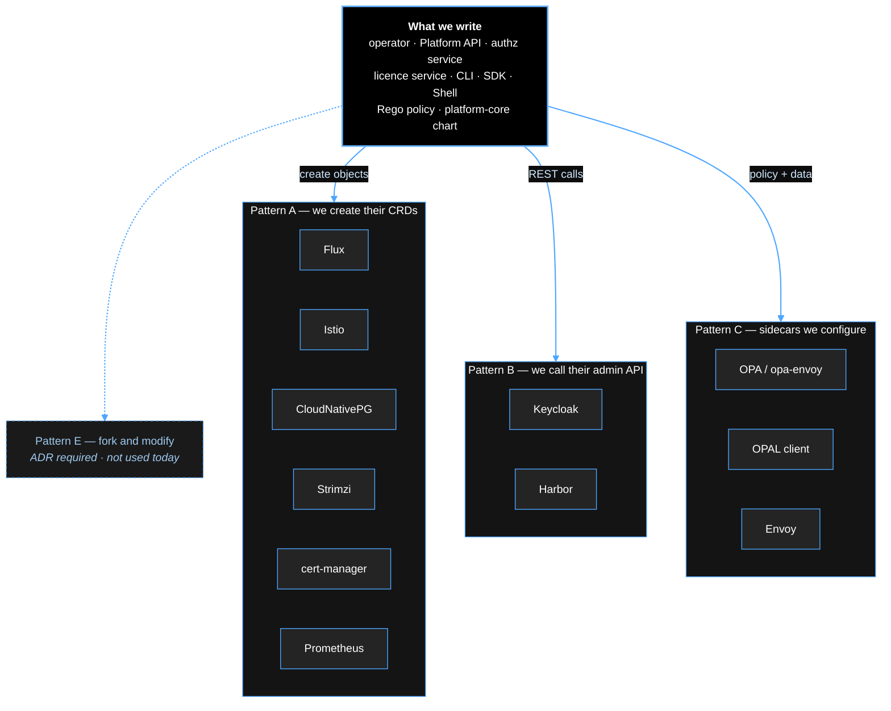

# The open-source stack, and how we integrate it

**The question this answers first:** *do we take Flux's source code, modify it, and make it part of
our operator?*

**No. We never fork, and we never vendor a modified copy.** We consume upstream projects in one of
four well-defined ways. Forking a project like Flux or Keycloak means inheriting its entire
maintenance burden — every CVE, every Kubernetes version bump, every upstream fix we then have to
re-apply by hand — in exchange for nothing we cannot get through its API.

---

## 1. The four integration patterns

Every component below is consumed through exactly one of these. If a proposal does not fit one of
them, it needs an ADR.

| Pattern | What it means | When | Example |
|---|---|---|---|
| **A — Deploy and drive via its API/CRDs** | Run the upstream release unmodified. We create *its* objects. | the component already has a declarative API | Flux, Strimzi, CloudNativePG, cert-manager, Istio |
| **B — Deploy and drive via its admin API** | Run unmodified; configure it over REST at runtime. | no CRDs, but a good admin API | Keycloak |
| **C — Run as a sidecar, supply its input** | Upstream image, our configuration/policy. | per-pod, latency-sensitive | OPA (`opa-envoy`), OPAL client, Envoy |
| **D — Import as a library** | Link a Go package into our binary. | we need in-process behaviour | Flux API types, OPA `rego` package, Helm SDK (dry-run only) |

**Pattern E — fork and modify — requires an ADR, is never the default, and has only ever been the
right answer when upstream is abandoned.** If we think we need it, the first step is opening an
upstream issue, not a branch.

---

## 2. Flux, specifically

The most likely thing to be misunderstood, so in detail.

**We do not fork Flux. We do not import its controllers. We do not reimplement Helm.**

Our operator imports Flux's **API types** (pattern D) and creates its **objects** (pattern A).
Flux's own controllers — installed as an unmodified upstream release — do the work.

```go
import (
    // Only the API types. A small, stable, dependency-light module published by the Flux
    // project exactly so that third parties can create its objects. This is the supported
    // integration path, not a clever trick.
    helmv2 "github.com/fluxcd/helm-controller/api/v2"
    sourcev1 "github.com/fluxcd/source-controller/api/v1"
)

// Our operator's entire relationship with Flux: build an object and apply it.
// Flux then pulls the chart, renders it, installs it, retries on failure, rolls back a bad
// upgrade, detects drift and reports health — none of which we write or maintain.
hr := &helmv2.HelmRelease{
    ObjectMeta: metav1.ObjectMeta{Name: "crm", Namespace: "platform-system"},
    Spec: helmv2.HelmReleaseSpec{
        Interval:        metav1.Duration{Duration: 5 * time.Minute},
        TargetNamespace: "module-crm",
        ChartRef:        &helmv2.CrossNamespaceSourceReference{Kind: "OCIRepository", Name: "crm"},
        Upgrade: &helmv2.Upgrade{
            Remediation: &helmv2.UpgradeRemediation{
                Retries:  3,
                Strategy: ptr.To(helmv2.RollbackRemediationStrategy),
            },
        },
        Values: values,
    },
}
return controllerutil.SetControllerReference(moduleInstance, hr, scheme)
```

**What we would be taking on by forking instead:** release history and rollback, drift detection,
dependency ordering, retry with backoff, OCI artifact pulling and verification, and Helm version
compatibility. That is months of work, permanently, and every hour of it is spent rebuilding
something that already works.

**The division of labour:** our operator decides *what should exist* (licence → entitlement →
version → values). Flux decides *how it gets applied*. Those are genuinely different problems, and
only the first one is ours.

---

## 3. The full stack

### Control plane

| Component | Licence | Pattern | What we write | What we never touch |
|---|---|---|---|---|
| **Keycloak** | Apache-2.0 | **B** + a custom theme | realm bootstrap, our Identity Service wrapping the Admin REST API, a login theme so the page is ours | Keycloak's Java source. If we need server-side behaviour, a **Keycloak SPI plugin** is the supported extension point — still not a fork |
| **Flux** (source, helm, kustomize controllers) | Apache-2.0 | **A** + **D** for types | `HelmRelease`, `OCIRepository` objects | controller source, Helm logic |
| **OPA** (`openpolicyagent/opa:*-envoy`) | Apache-2.0 | **C**, optionally **D** | our Rego policy, the bundle, the decision input contract | OPA itself. Go modules may embed the `rego` package instead of a sidecar — still upstream, unmodified |
| **OPAL** (server + client) | Apache-2.0 | **A/C** | data and policy source configuration | OPAL source. *Phase 2 — and the one component here with real fork risk: single primary sponsor, smaller project. The ADR records that we would maintain a pinned fork if abandoned, and that bundle polling is the fallback* |
| **Istio** + Envoy | Apache-2.0 | **A** / **C** | `Gateway`, `HTTPRoute`, `RequestAuthentication`, `AuthorizationPolicy`, `extensionProviders` | istiod, Envoy. Custom filters would be WASM, not a patch |
| **Harbor** | Apache-2.0 | **B** | projects, robot accounts, replication rules, OCI artifact layout | Harbor source |

### Data and infrastructure

| Component | Licence | Pattern | What we write |
|---|---|---|---|
| **CloudNativePG** | Apache-2.0 | **A** | `Cluster`, `Database`, `ScheduledBackup` objects per module |
| **Strimzi** (Kafka) | Apache-2.0 | **A** | `Kafka`, `KafkaTopic`, `KafkaUser` generated from module descriptors |
| **cert-manager** | Apache-2.0 | **A** | `Issuer`, `Certificate` |
| **External Secrets Operator** | Apache-2.0 | **A** | `SecretStore`, `ExternalSecret` |
| **Redis** | RSALv2/SSPL — **check** | **A** via an operator | only as a cache and as OPAL's broadcast channel. *Licence change means we prefer Valkey (BSD) for anything we redistribute — flagged for an ADR* |
| **MinIO** | AGPL-3.0 — **check** | **A** | fallback object store only; customers normally supply S3. *AGPL in a redistributed product needs legal sign-off* |

### Observability and security

| Component | Licence | Pattern | What we write |
|---|---|---|---|
| **Prometheus / Alertmanager** | Apache-2.0 | **A** | `ServiceMonitor`, `PrometheusRule` — alerts as code, generated per module |
| **Grafana** | AGPL-3.0 — **check** | **A** | dashboards as ConfigMaps, embedded via SSO. *AGPL: we ship it unmodified and do not link to it, which is the ordinary case, but confirm with legal* |
| **Loki / Tempo** | AGPL-3.0 — check | **A** | collection config |
| **OpenTelemetry** | Apache-2.0 | **D** | instrumentation in our services and in `pkg/sdk` |
| **SPIRE / SPIFFE** | Apache-2.0 | **A** | registration entries, ztunnel identity |
| **Falco** + Falcosidekick | Apache-2.0 | **A** | custom rules, routing into Alertmanager |
| **gVisor** | Apache-2.0 | runtime class | `RuntimeClass` and which workloads use it |
| **Kyverno** or **Gatekeeper** | Apache-2.0 | **A** | admission policies: verify cosign signatures, no privileged pods |

### Our Go dependencies (pattern D)

| Library | Use |
|---|---|
| `sigs.k8s.io/controller-runtime`, `kubebuilder` | the operator |
| `k8s.io/client-go`, `apimachinery` | Kubernetes access |
| `fluxcd/*/api` | Flux object types only |
| `open-policy-agent/opa/rego` | optional in-process policy evaluation |
| `helm.sh/helm/v3` | **dry-run template rendering only**, for the admission webhook. Never release management |
| `spf13/cobra`, `spf13/viper` | the CLI |
| `santhosh-tekuri/jsonschema` | JSON Schema 2020-12 validation |
| `go-jose/go-jose` or `aidantwoods/go-paseto` | licence signature verification |
| `oapi-codegen` | generate the client from our OpenAPI |

**Licence discipline:** anything we *redistribute* must be permissive (Apache-2.0, MIT, BSD) or
reviewed by legal. Rows marked **check** are for telco customers' procurement questionnaires, which
will ask. Resolve them before the first customer install, not during it.

---

## 4. How they fit together



Read it this way: **we write the business logic of a platform and orchestrate proven components.**
Every box outside our node is something we deploy and configure, never something we maintain.

---

## 5. Rules for adding a dependency

1. Which of the four patterns? If none fits, open an ADR before writing code.
2. Licence permissive, or cleared by legal?
3. Does it work **air-gapped**? No phone-home, no license server of its own, images mirrorable to
   Harbor. This disqualifies most commercial tooling and is not negotiable for telco.
4. Pin an exact version. Renovate or Dependabot proposes bumps; a human reviews them.
5. What is the failure mode when it is down, and what is the exit plan if the project is abandoned?
   Answer both in the ADR — "we would have to rewrite everything" is a reason to choose differently.
6. Does it add a CRD that collides with something a customer already runs? Customers have existing
   clusters with existing operators, and two Prometheus operators in one cluster is a support case.

## 6. Version policy

- Pin everything: Go modules, subcharts, image digests. **No `latest`, anywhere.** An air-gapped
  customer cannot resolve a floating tag, and a floating tag makes a deploy irreproducible.
- Track upstream N-1 for Kubernetes; test against N.
- Security patches inside a week for anything in the data path.
- A dependency we cannot upgrade for six months is technical debt with an issue, not a steady state.
